# poster

<p align="center">
  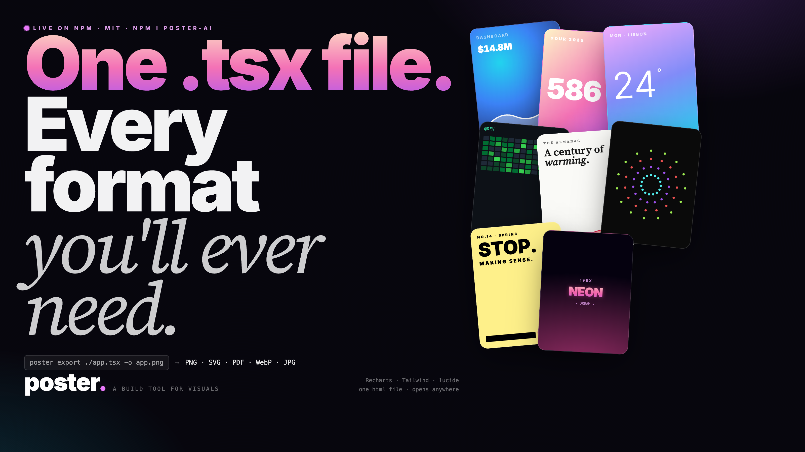
</p>

> **One `.tsx` file, every format you'll ever need.**

Write a React component. Get a self-contained `.html` file, a PNG, a PDF, an
SVG, a JPG, or a WebP at any canvas size. Works as a **CLI** for humans and
as a **library** for agents and services.

```bash
npm install -g poster-ai        # CLI (installs the `poster` binary)
npm install poster-ai           # library
```

---

## CLI

```bash
poster build app.tsx -o app.html            # self-contained .html
poster export app.tsx -o out.png            # PNG, browserless by default
poster export app.tsx -o out.pdf --engine chrome   # pdf / svg / jpg / webp
```

**The canvas comes from the TSX itself.** Declare `w-[Npx]` (and optionally `h-[Npx]`) on the root element - the renderer measures it and crops to that exact box. `--width` / `--height` are optional overrides for forcing a viewport size. Every command also supports `--json` and `--quiet`.

**Two engines.** PNG export defaults to **`takumi`** — a pure-Rust headless renderer that needs no Chrome download. Pass `--engine chrome` for PDF, SVG, JPG, WebP, or for pixel parity with Chrome on complex CSS (gradient text, multi-layer blurs, SVG `<text>`). See [Engines](#engines) for the trade-offs.

### Inline authoring for agents

Pass `-` as the entry and pipe TSX on stdin:

```bash
poster export - -o hero.png <<'EOF'
export default function() {
  return (
    <div className="w-[1200px] h-[600px] flex items-center justify-center bg-black text-white">
      <h1 className="text-7xl font-black">Hello, poster.</h1>
    </div>
  );
}
EOF
```

Stdin is persisted to `.poster/hero.tsx` by default so you can iterate - 
either re-pipe updated TSX, or edit the saved file and run
`poster export .poster/hero.tsx -o hero.png`. Pass `--ephemeral` for
one-shot CI renders that touch no disk.

---

## Library

```ts
import { writeFileSync } from "node:fs";
import { Poster } from "poster-ai";

const poster = new Poster();

// TSX → self-contained HTML string
const html = await poster.buildHtml(
  { tsx: `export default () => <h1 className="text-5xl p-10">Hi</h1>` },
  { title: "Hello", width: 1200, height: 600 },
);

// TSX → PNG Buffer via the default (takumi) engine. No browser needed.
const png = await poster.render(
  { tsx: source },
  { format: "png", width: 1600, height: 900 },
);
writeFileSync("poster.png", png);

// PDF / SVG / JPG / WebP need the chrome engine.
const pdf = await new Poster({ engine: "chrome" }).render(
  { file: "./app.tsx" },
  { format: "pdf", width: 1400, height: 1800 },
);
```

- **Discriminated input.** `{ tsx }` for in-memory source, `{ file }` for a
  path. No ambiguity.
- **Pure.** Returns data; the caller writes it. No stdout writes, no
  `process.exit`, errors throw.
- **Typed.** Full `.d.ts` shipped. `BuildOptions`, `RenderOptions`,
  `ExportFormat`, `DEFAULTS` all exported.

---
<!-- gallery:start -->
## Gallery

All 52 examples below render through the same pipeline. Each row pairs the rendered output with the prompt that produced it. The 14 hand-authored seed examples (`brutalist`, `calendar`, `concert`, `dashboard`, `dataart`, `devwrap`, `editorial`, `fitness`, `memphis`, `neon`, `showcase`, `vogue`, `weather`, `wrapped`) have reverse-engineered prompts; the rest were generated end-to-end.

<table>
  <tr>
    <td width="45%" valign="top"><a href="examples/anatomy.png">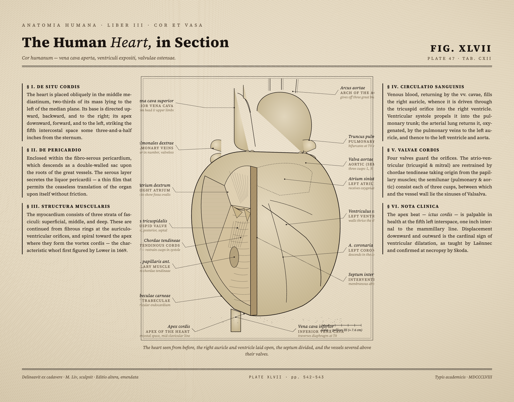</a></td>
    <td valign="top"><strong><code>anatomy</code></strong> · <a href="examples/anatomy.tsx">source</a> · <a href="examples/anatomy.txt">prompt</a><br/><br/><sub>Make a Gray's-Anatomy style anatomical diagram of the human heart - cross-section drawing with labeled chambers/valves/arteries, leader lines with Latin terms, tiny paragraphs of clinical detail, plate number and 'FIG. XLVII' caption. Steel engraving aesthetic.</sub></td>
  </tr>
  <tr>
    <td width="45%" valign="top"><a href="examples/announce.png">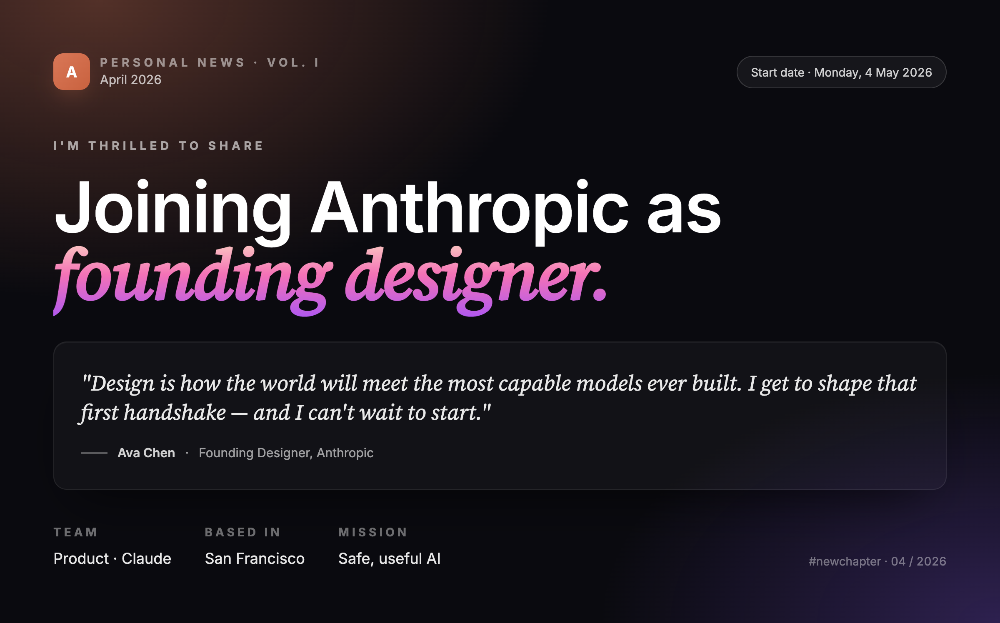</a></td>
    <td valign="top"><strong><code>announce</code></strong> · <a href="examples/announce.tsx">source</a> · <a href="examples/announce.txt">prompt</a><br/><br/><sub>Make a LinkedIn-ready announcement card saying 'Joining Anthropic as founding designer.' Include a quote, company logo placeholder, start date, and gradient backdrop.</sub></td>
  </tr>
  <tr>
    <td width="45%" valign="top"><a href="examples/bloomberg.png">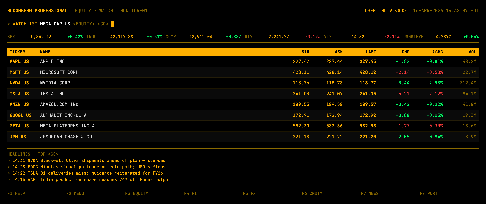</a></td>
    <td valign="top"><strong><code>bloomberg</code></strong> · <a href="examples/bloomberg.tsx">source</a> · <a href="examples/bloomberg.txt">prompt</a><br/><br/><sub>Make a market dashboard that LOOKS LIKE Bloomberg Terminal - black background, monospaced amber-on-black, dense rows of tickers. Show 8 tickers with bid/ask/last/chg/vol.</sub></td>
  </tr>
  <tr>
    <td width="45%" valign="top"><a href="examples/blueprint.png">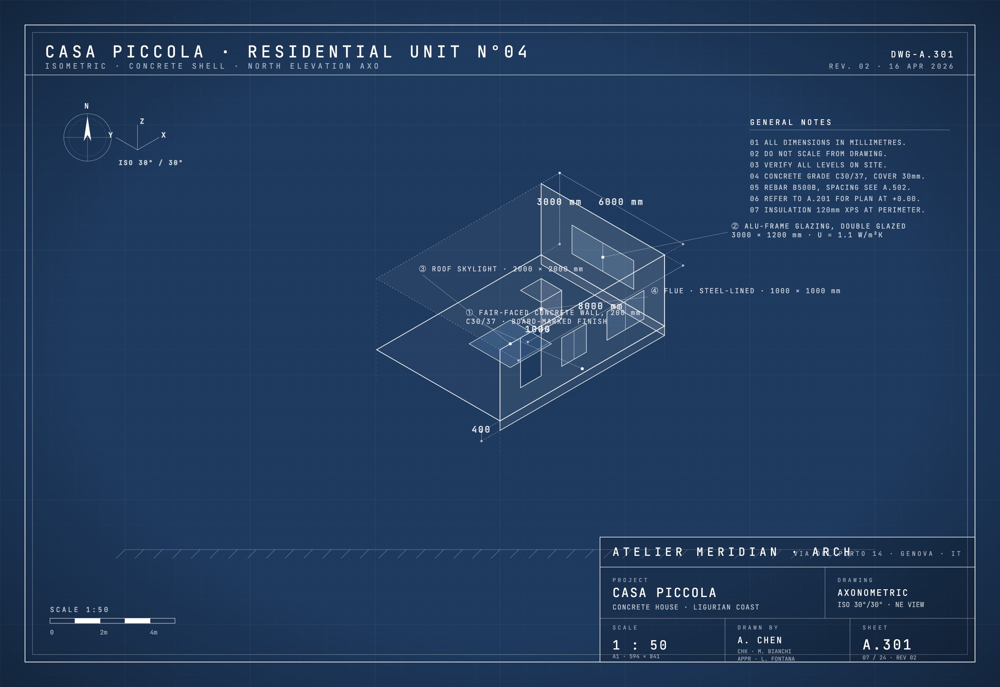</a></td>
    <td valign="top"><strong><code>blueprint</code></strong> · <a href="examples/blueprint.tsx">source</a> · <a href="examples/blueprint.txt">prompt</a><br/><br/><sub>Make an architecture blueprint poster - axonometric isometric drawing of a small concrete house, blue paper background, white technical lines, dimensions in mm, title block bottom-right with project name, scale, drawn-by, sheet number.</sub></td>
  </tr>
  <tr>
    <td width="45%" valign="top"><a href="examples/boarding.png">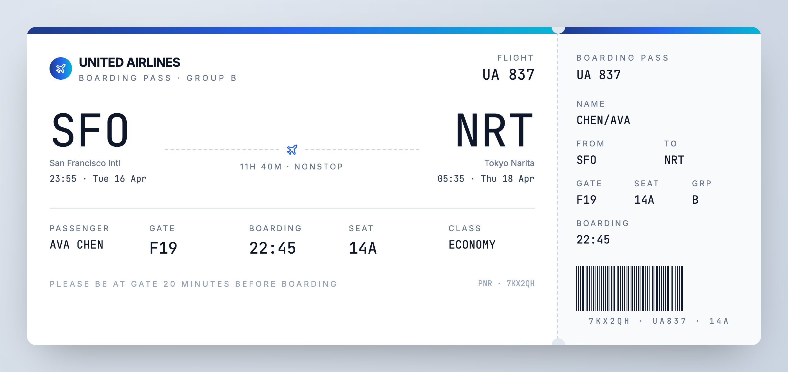</a></td>
    <td valign="top"><strong><code>boarding</code></strong> · <a href="examples/boarding.tsx">source</a> · <a href="examples/boarding.txt">prompt</a><br/><br/><sub>Make an airline boarding pass for SFO → NRT, passenger Ava Chen, flight UA837, seat 14A, gate F19, boarding 22:45. Use perforated divider, monospace ticket type, barcode placeholder, airline color band.</sub></td>
  </tr>
  <tr>
    <td width="45%" valign="top"><a href="examples/brutalist.png">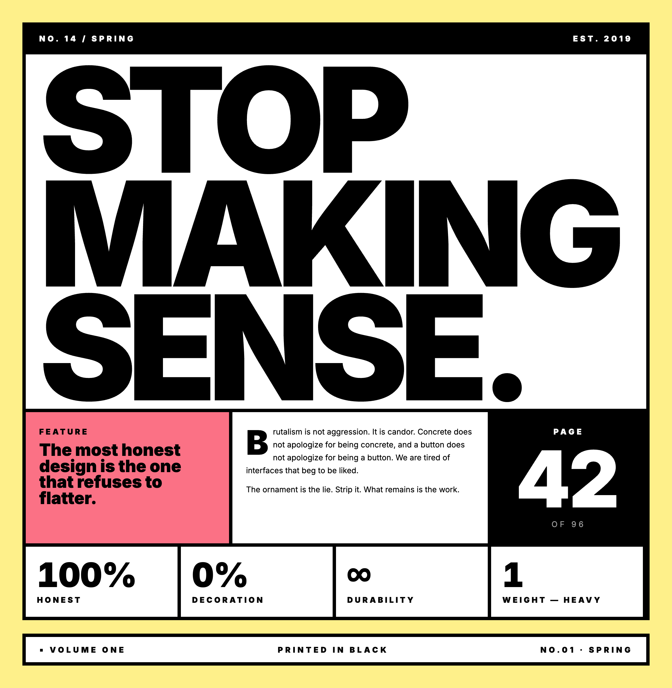</a></td>
    <td valign="top"><strong><code>brutalist</code></strong> · <a href="examples/brutalist.tsx">source</a> · <a href="examples/brutalist.txt">prompt</a><br/><br/><sub>Make a brutalist product spec card poster - flat saturated yellow background, white inner panel with thick 6px black borders, all-caps Inter type, hard rectangles, no gradients. Headline + a small spec list (decoration / durability / weight) in the layout style of a 1990s industrial parts catalog.</sub></td>
  </tr>
  <tr>
    <td width="45%" valign="top"><a href="examples/calendar.png">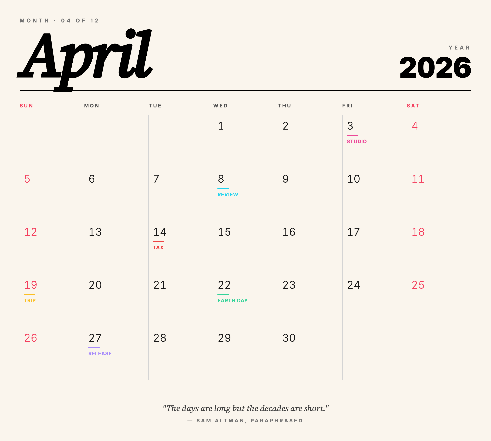</a></td>
    <td valign="top"><strong><code>calendar</code></strong> · <a href="examples/calendar.tsx">source</a> · <a href="examples/calendar.txt">prompt</a><br/><br/><sub>Make a monthly calendar poster for April 2026 - clean grid of 7 columns × 6 rows starting on Wednesday, weekday header row, a few date cells annotated with events ('Earth Day', 'Release'), a quiet inspirational quote pinned to the layout ('The days are long but the decades are short'). Editorial typography, neutral palette.</sub></td>
  </tr>
  <tr>
    <td width="45%" valign="top"><a href="examples/changelog.png">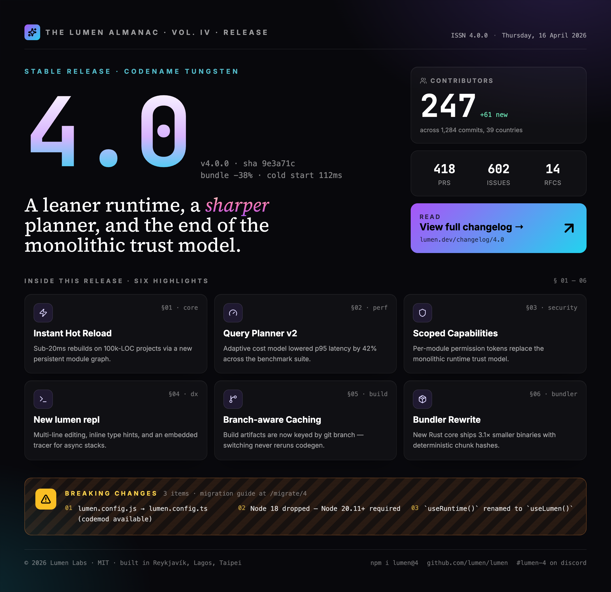</a></td>
    <td valign="top"><strong><code>changelog</code></strong> · <a href="examples/changelog.tsx">source</a> · <a href="examples/changelog.txt">prompt</a><br/><br/><sub>Make a release-notes poster for 'Lumen 4.0' - software changelog formatted as a magazine cover. Big version number, date, 6 feature highlights with icons, breaking-changes warning band, contributor count, 'view full changelog' CTA. Developer-tool aesthetic.</sub></td>
  </tr>
  <tr>
    <td width="45%" valign="top"><a href="examples/cocktail.png">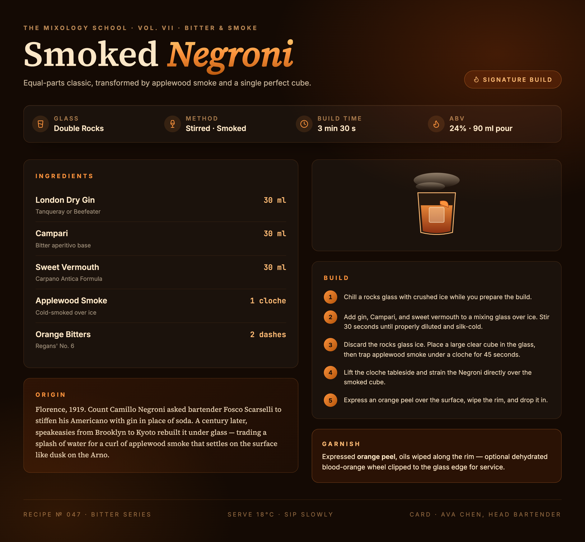</a></td>
    <td valign="top"><strong><code>cocktail</code></strong> · <a href="examples/cocktail.tsx">source</a> · <a href="examples/cocktail.txt">prompt</a><br/><br/><sub>Make a cocktail recipe card for 'Smoked Negroni' - ingredient list with measurements, glass type icon, garnish notes, build steps, brief origin story, mixology-school clean layout. Warm amber and burnt-orange palette.</sub></td>
  </tr>
  <tr>
    <td width="45%" valign="top"><a href="examples/comic.png">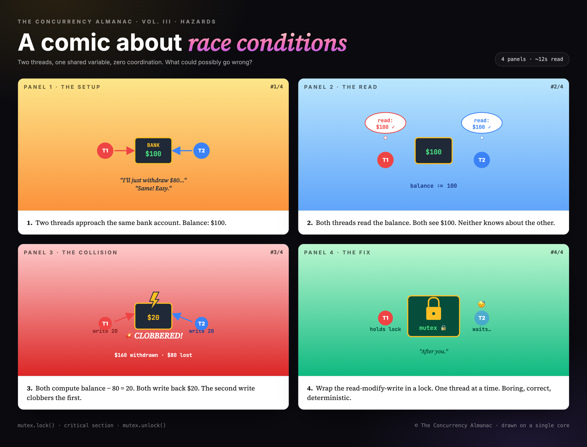</a></td>
    <td valign="top"><strong><code>comic</code></strong> · <a href="examples/comic.tsx">source</a> · <a href="examples/comic.txt">prompt</a><br/><br/><sub>Make a 4-panel comic strip explaining race conditions in concurrent code. Each panel should have a caption and a different stylized scene.</sub></td>
  </tr>
  <tr>
    <td width="45%" valign="top"><a href="examples/comicbook.png">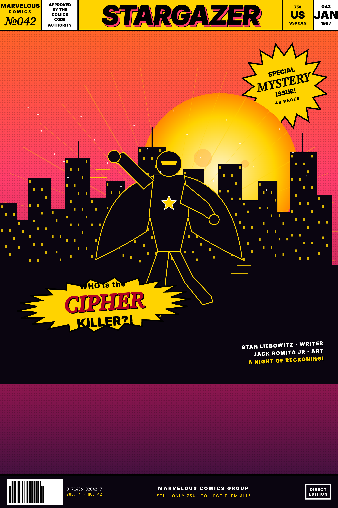</a></td>
    <td valign="top"><strong><code>comicbook</code></strong> · <a href="examples/comicbook.tsx">source</a> · <a href="examples/comicbook.txt">prompt</a><br/><br/><sub>Make a Marvel-style comic book cover - issue #042 of 'STARGAZER' - a hero in dynamic pose silhouette against a city skyline, big issue number top-left, price tag, UPC barcode bottom-left, 'JAN' month tab, splashy headline 'WHO is the Cipher Killer?!'. June 1987 vibe.</sub></td>
  </tr>
  <tr>
    <td width="45%" valign="top"><a href="examples/concert.png">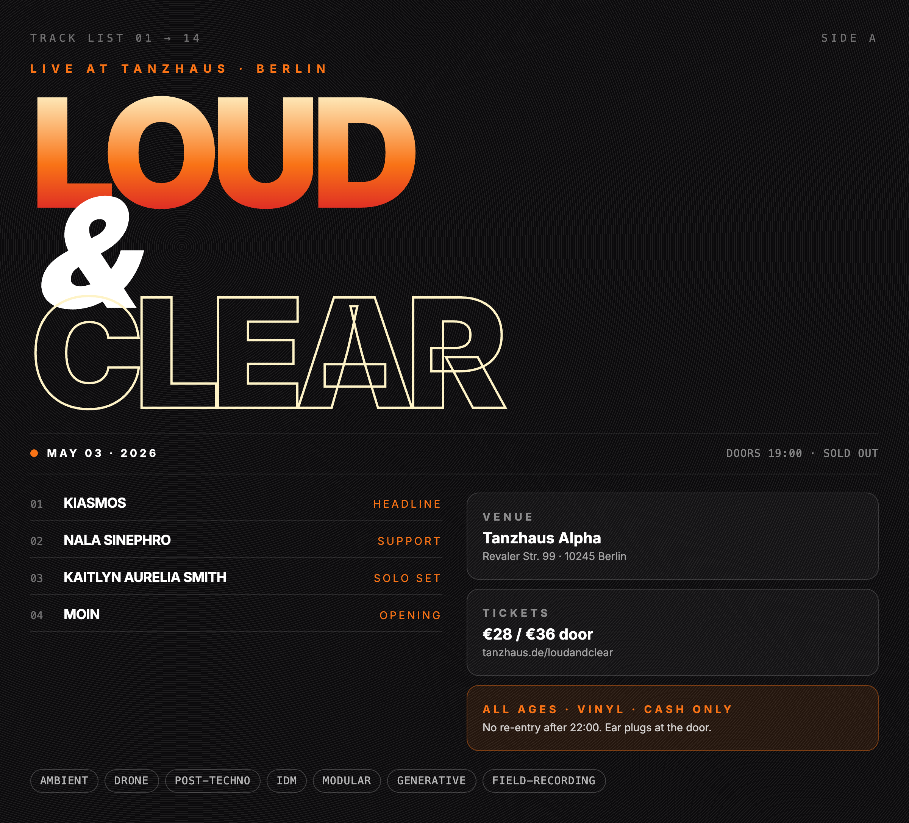</a></td>
    <td valign="top"><strong><code>concert</code></strong> · <a href="examples/concert.tsx">source</a> · <a href="examples/concert.txt">prompt</a><br/><br/><sub>Make a concert poster for an electronic / ambient lineup at a small venue. Headliner Kiasmos, support Nala Sinephro, opening Kaitlyn Aurelia Smith. Black background with subtle noise texture, large title, minimal date / venue / ticket info, low-contrast moody palette.</sub></td>
  </tr>
  <tr>
    <td width="45%" valign="top"><a href="examples/crossword.png">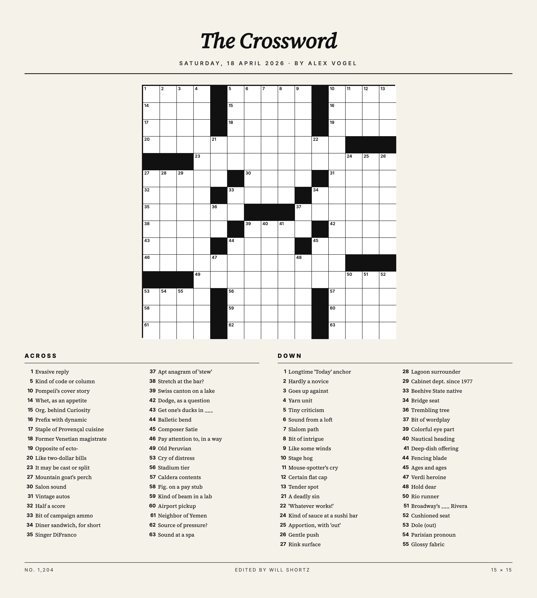</a></td>
    <td valign="top"><strong><code>crossword</code></strong> · <a href="examples/crossword.tsx">source</a> · <a href="examples/crossword.txt">prompt</a><br/><br/><sub>Make a NYT-style crossword puzzle poster - 15x15 black/white grid with numbered white squares and black blockers, 'Across' and 'Down' clue lists in two columns below. Title 'Saturday, 18 April 2026 · by Alex Vogel'. The grid and clues should be real-looking (not solvable, just visually correct).</sub></td>
  </tr>
  <tr>
    <td width="45%" valign="top"><a href="examples/dashboard.png">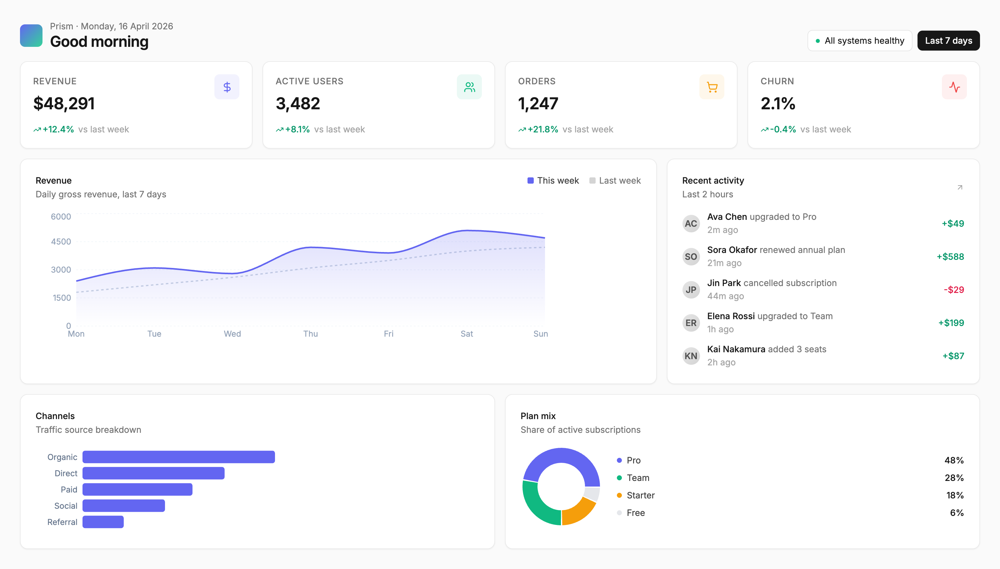</a></td>
    <td valign="top"><strong><code>dashboard</code></strong> · <a href="examples/dashboard.tsx">source</a> · <a href="examples/dashboard.txt">prompt</a><br/><br/><sub>Make a single-page analytics dashboard poster - 1600px wide, Recharts area + bar charts, top-customer table (Ava Chen, Sora Okafor, Jin Park, Elena Rossi, Kai Nakamura), traffic source breakdown (Organic / Referral / etc), KPI tiles. Dark theme with gradient fills, precise tabular numbers.</sub></td>
  </tr>
  <tr>
    <td width="45%" valign="top"><a href="examples/dataart.png">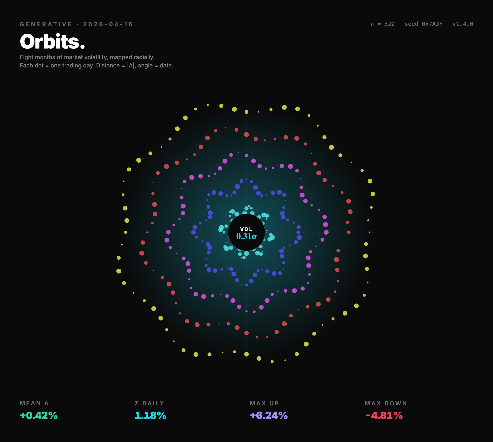</a></td>
    <td valign="top"><strong><code>dataart</code></strong> · <a href="examples/dataart.tsx">source</a> · <a href="examples/dataart.txt">prompt</a><br/><br/><sub>Make an abstract data-art poster - black background, a generative composition of ~64 dots arranged in 5 concentric rings with subtle radial variations, minimal type, single quiet annotation ('Max down'). Algorithmic / generative aesthetic, no charts in the traditional sense.</sub></td>
  </tr>
  <tr>
    <td width="45%" valign="top"><a href="examples/devwrap.png">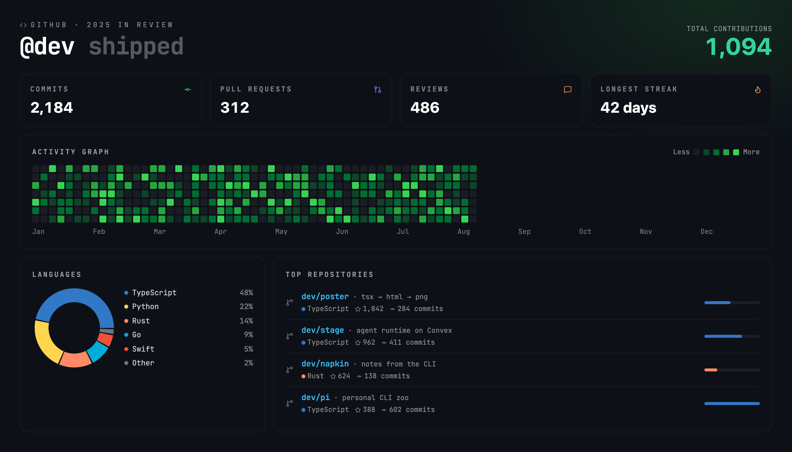</a></td>
    <td valign="top"><strong><code>devwrap</code></strong> · <a href="examples/devwrap.tsx">source</a> · <a href="examples/devwrap.txt">prompt</a><br/><br/><sub>Make a developer year-in-review poster (1600×1000) - GitHub-style contribution heatmap, language mix donut chart (TypeScript heavy), top repositories list, KPI tiles for commits / PRs / reviews / longest streak. Dark theme, monospace accents, code-tool aesthetic.</sub></td>
  </tr>
  <tr>
    <td width="45%" valign="top"><a href="examples/diverging.png">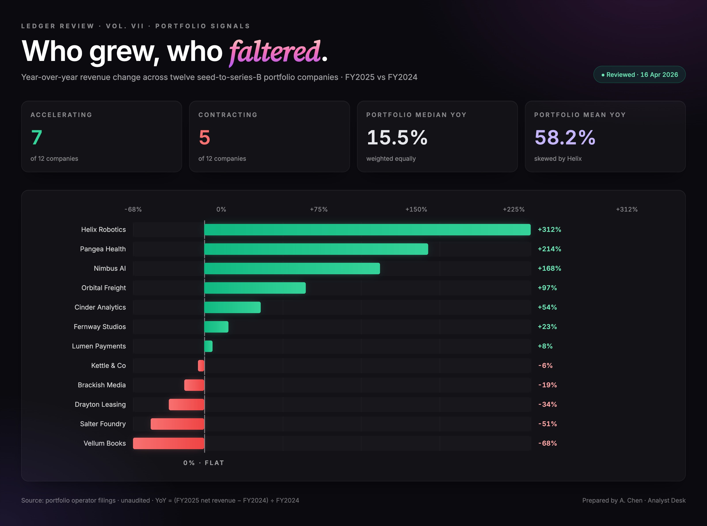</a></td>
    <td valign="top"><strong><code>diverging</code></strong> · <a href="examples/diverging.tsx">source</a> · <a href="examples/diverging.txt">prompt</a><br/><br/><sub>Make an analyst chart showing 12 startups' YoY revenue change as a horizontal bar chart - 5 of them are negative (down to -68%), 7 are positive (up to +312%). Need to handle the zero-line properly.</sub></td>
  </tr>
  <tr>
    <td width="45%" valign="top"><a href="examples/editorial.png">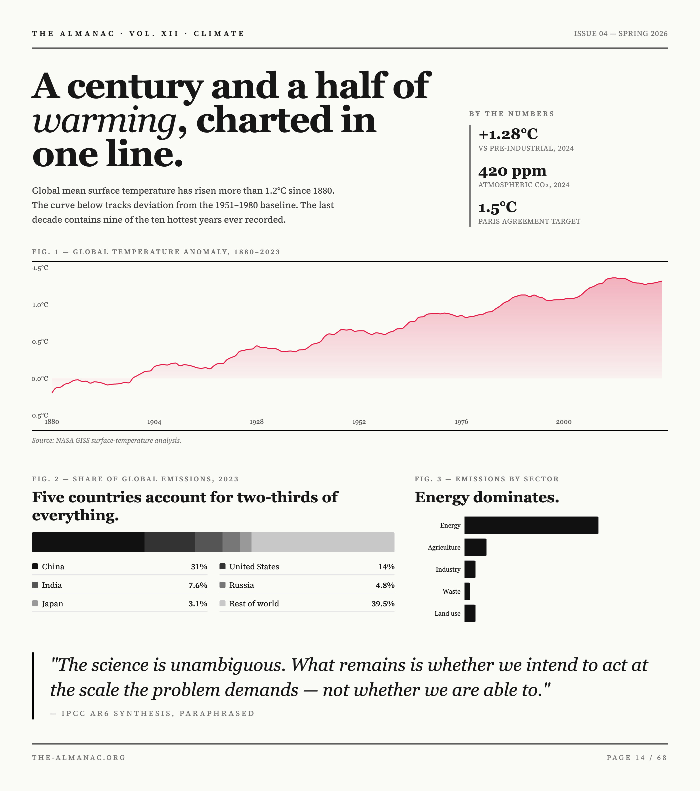</a></td>
    <td valign="top"><strong><code>editorial</code></strong> · <a href="examples/editorial.tsx">source</a> · <a href="examples/editorial.txt">prompt</a><br/><br/><sub>Make a tall editorial data-story magazine spread (1400×1800) about climate emissions - magazine-grade typography (Source Serif 4 / Georgia), inline charts (United States vs Rest of world, breakdown by sector: Agriculture / Industry / Land use), pull quotes, Paris Agreement target line annotation. Long-form data journalism feel.</sub></td>
  </tr>
  <tr>
    <td width="45%" valign="top"><a href="examples/element.png">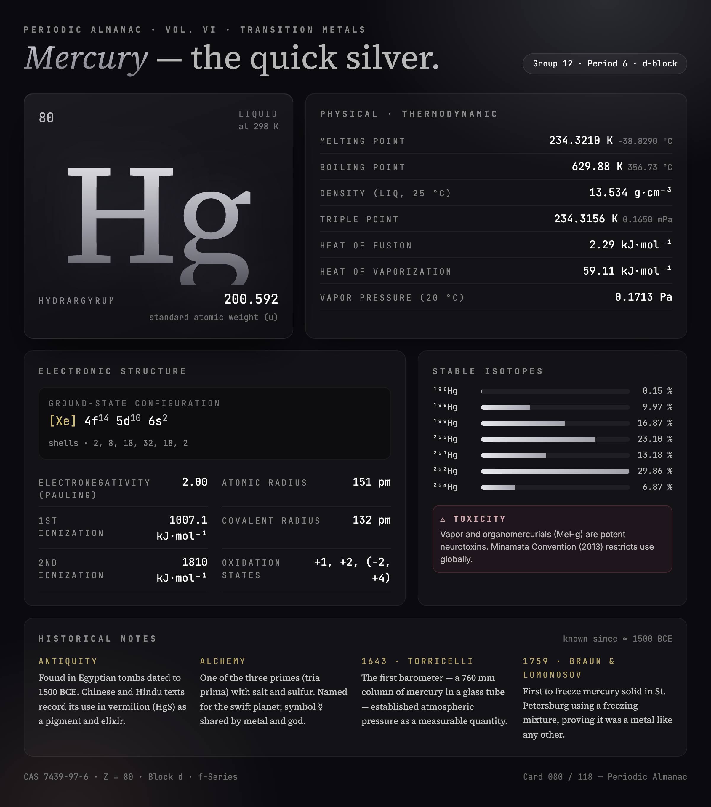</a></td>
    <td valign="top"><strong><code>element</code></strong> · <a href="examples/element.tsx">source</a> · <a href="examples/element.txt">prompt</a><br/><br/><sub>Make a periodic element trading card for Mercury (Hg) - atomic number 80, electron configuration, atomic weight, melting/boiling points, electronegativity, key historical facts, dense scientific layout.</sub></td>
  </tr>
  <tr>
    <td width="45%" valign="top"><a href="examples/familytree.png">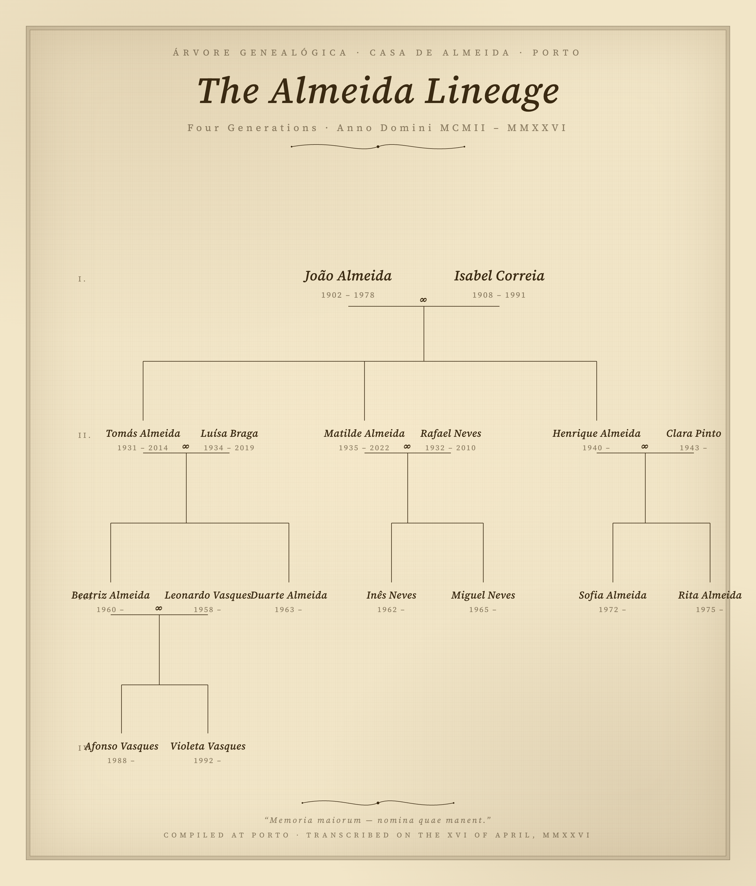</a></td>
    <td valign="top"><strong><code>familytree</code></strong> · <a href="examples/familytree.tsx">source</a> · <a href="examples/familytree.txt">prompt</a><br/><br/><sub>Make a family-tree poster for the fictional Almeida lineage spanning 4 generations - 16 names, marriage/lineage lines, dates, oldest at the top in a tree diagram. Vellum-paper feel with copperplate-style serif type.</sub></td>
  </tr>
  <tr>
    <td width="45%" valign="top"><a href="examples/festival.png">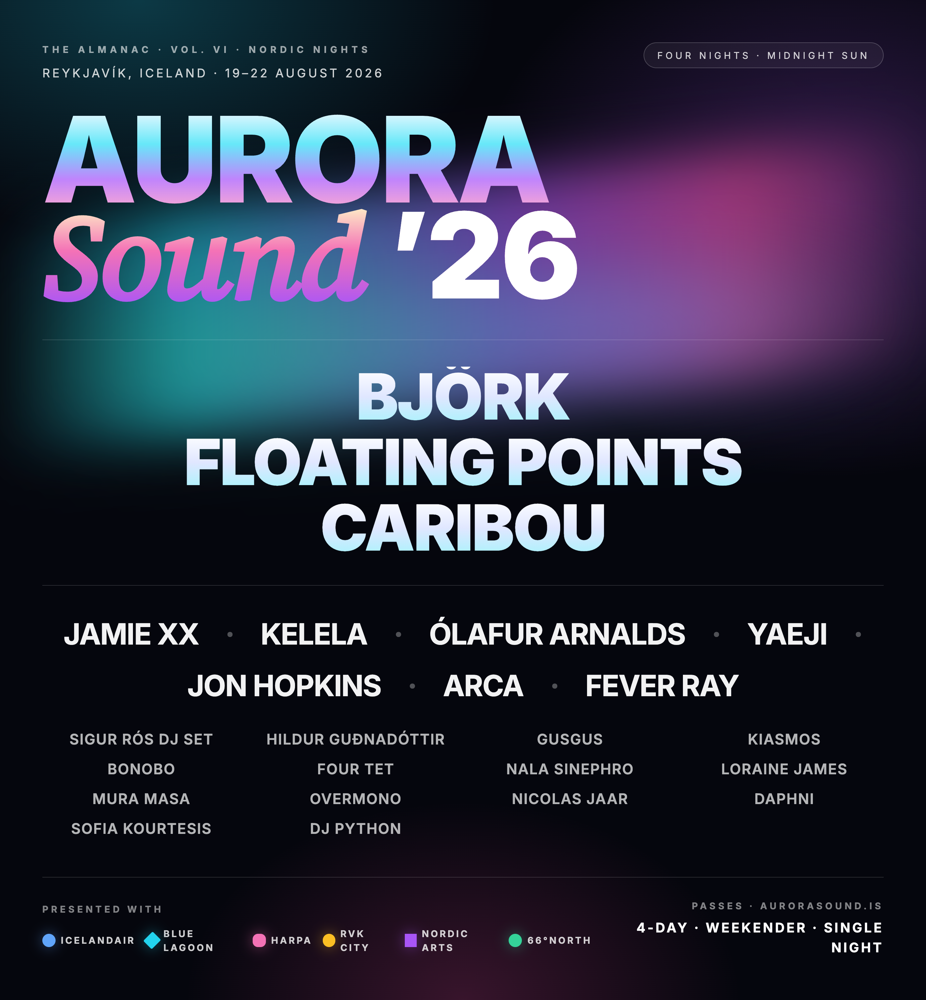</a></td>
    <td valign="top"><strong><code>festival</code></strong> · <a href="examples/festival.tsx">source</a> · <a href="examples/festival.txt">prompt</a><br/><br/><sub>Make a music festival lineup poster for 'Aurora Sound 2026' - 24 artist names with strict size hierarchy by tier (3 headliners HUGE, 7 second tier medium, 14 small bottom rows). Festival dates, location (Reykjavík), and partner logos as colored shapes at the bottom.</sub></td>
  </tr>
  <tr>
    <td width="45%" valign="top"><a href="examples/fitness.png">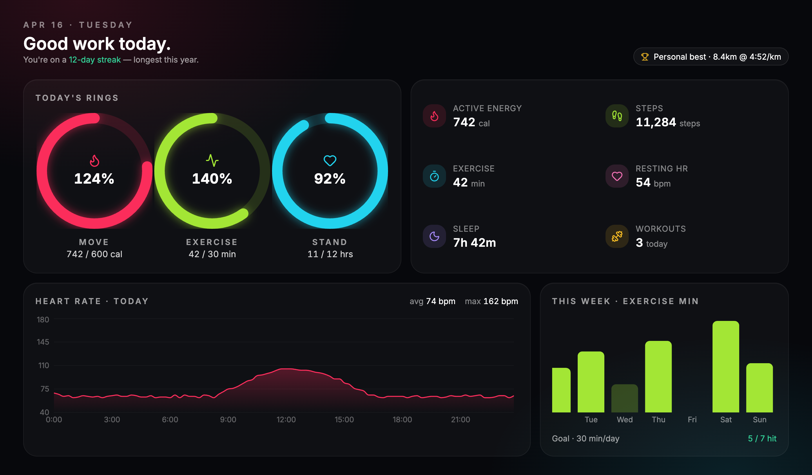</a></td>
    <td valign="top"><strong><code>fitness</code></strong> · <a href="examples/fitness.tsx">source</a> · <a href="examples/fitness.txt">prompt</a><br/><br/><sub>Make a fitness dashboard poster (1400×900) styled like Apple Fitness - concentric activity rings (move / exercise / stand), workout history strip, KPI tiles (Active energy / Exercise minutes / Resting HR / Workouts), clean dark/light cards, Inter type.</sub></td>
  </tr>
  <tr>
    <td width="45%" valign="top"><a href="examples/hackathon.png">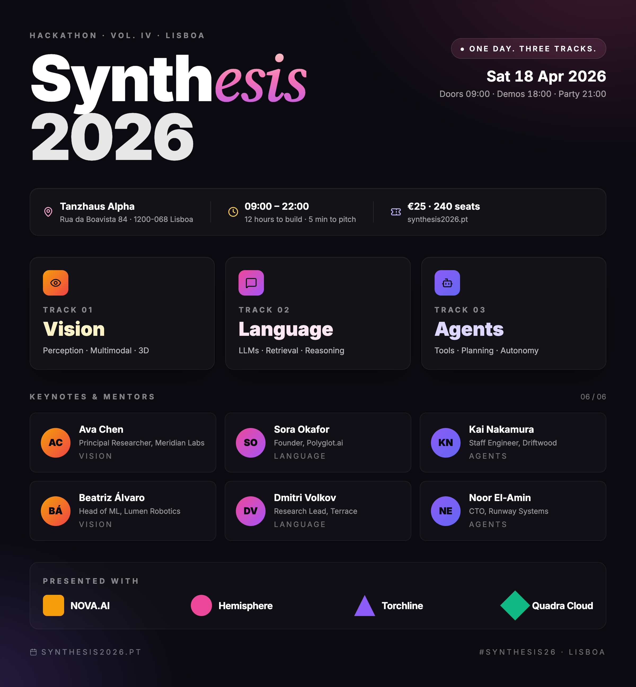</a></td>
    <td valign="top"><strong><code>hackathon</code></strong> · <a href="examples/hackathon.tsx">source</a> · <a href="examples/hackathon.txt">prompt</a><br/><br/><sub>Make an event poster for a one-day AI hackathon called 'Synthesis 2026' in Lisbon. 3 tracks (Vision, Language, Agents), 6 speakers with fake names, venue Tanzhaus Alpha, doors 9am, 4 sponsor logos implied as colored shapes.</sub></td>
  </tr>
  <tr>
    <td width="45%" valign="top"><a href="examples/i18n.png">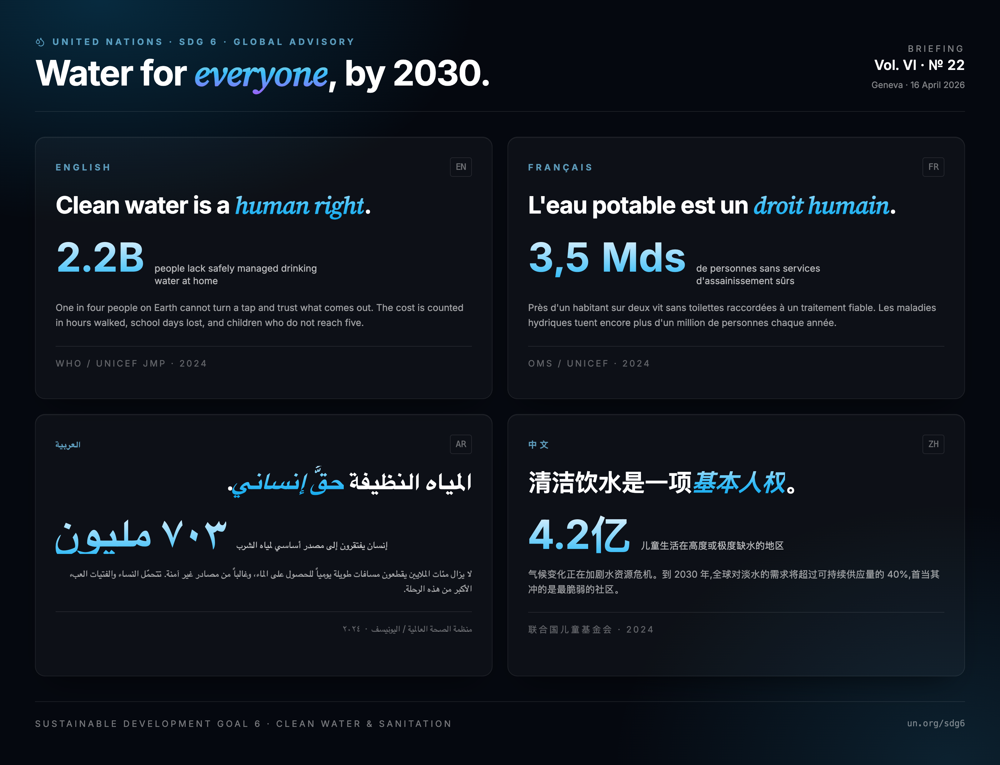</a></td>
    <td valign="top"><strong><code>i18n</code></strong> · <a href="examples/i18n.tsx">source</a> · <a href="examples/i18n.txt">prompt</a><br/><br/><sub>Make a UN-style poster about clean water access. Same headline in 4 languages: English, French, Arabic (RTL!), Mandarin. Plus a stat block in each.</sub></td>
  </tr>
  <tr>
    <td width="45%" valign="top"><a href="examples/illuminated.png">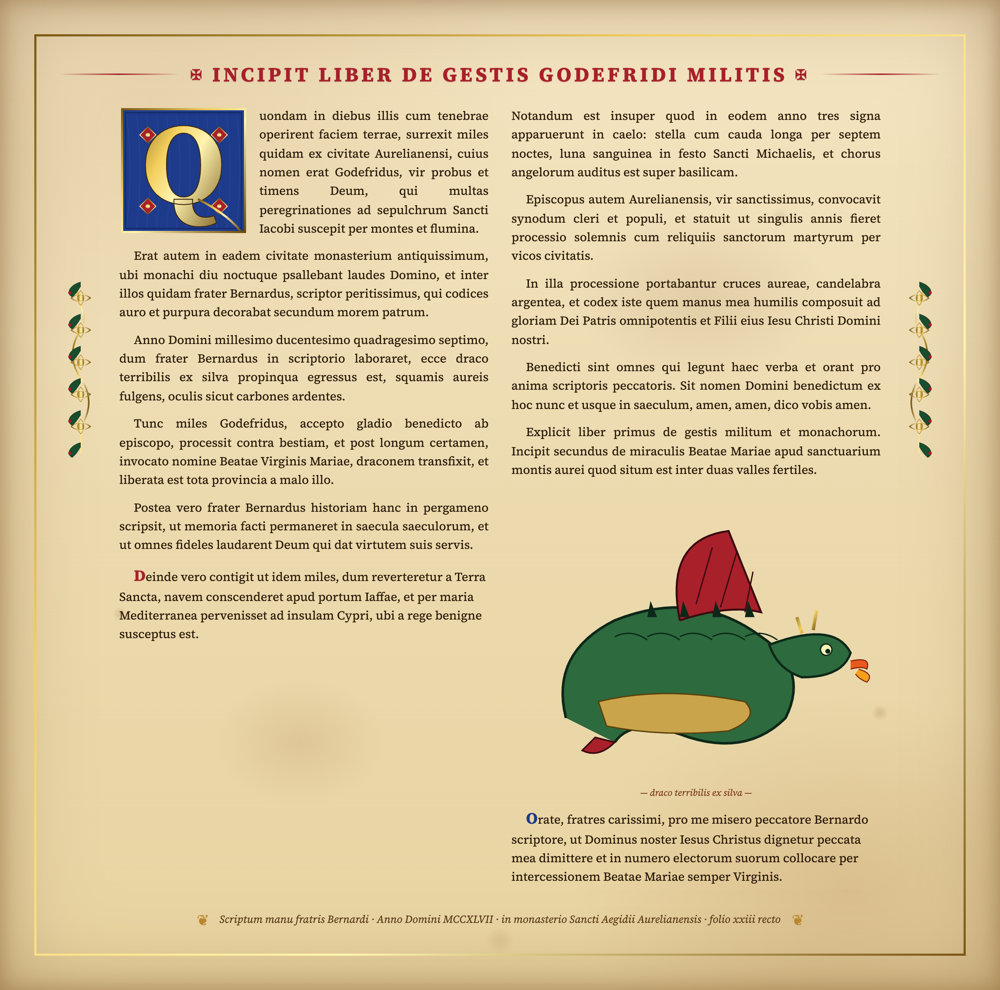</a></td>
    <td valign="top"><strong><code>illuminated</code></strong> · <a href="examples/illuminated.tsx">source</a> · <a href="examples/illuminated.txt">prompt</a><br/><br/><sub>Make a medieval illuminated manuscript page - ornate drop-cap initial letter 'Q', two columns of Latin-looking placeholder text in a blackletter serif, gold leaf flourishes in the margins, a small marginalia illustration (a dragon or a monk), vellum paper background.</sub></td>
  </tr>
  <tr>
    <td width="45%" valign="top"><a href="examples/isotype.png">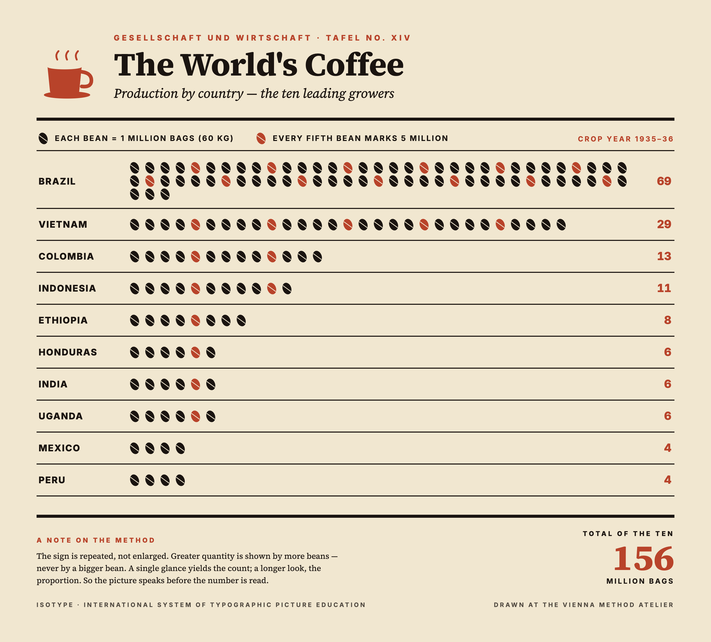</a></td>
    <td valign="top"><strong><code>isotype</code></strong> · <a href="examples/isotype.tsx">source</a> · <a href="examples/isotype.txt">prompt</a><br/><br/><sub>Make an Otto Neurath ISOTYPE-style infographic - global coffee production by country, using repeated pictograms of coffee cups/beans to represent quantities. Flat 1930s social-statistics aesthetic, limited 3-color palette (black, rust, cream).</sub></td>
  </tr>
  <tr>
    <td width="45%" valign="top"><a href="examples/leaderboard.png">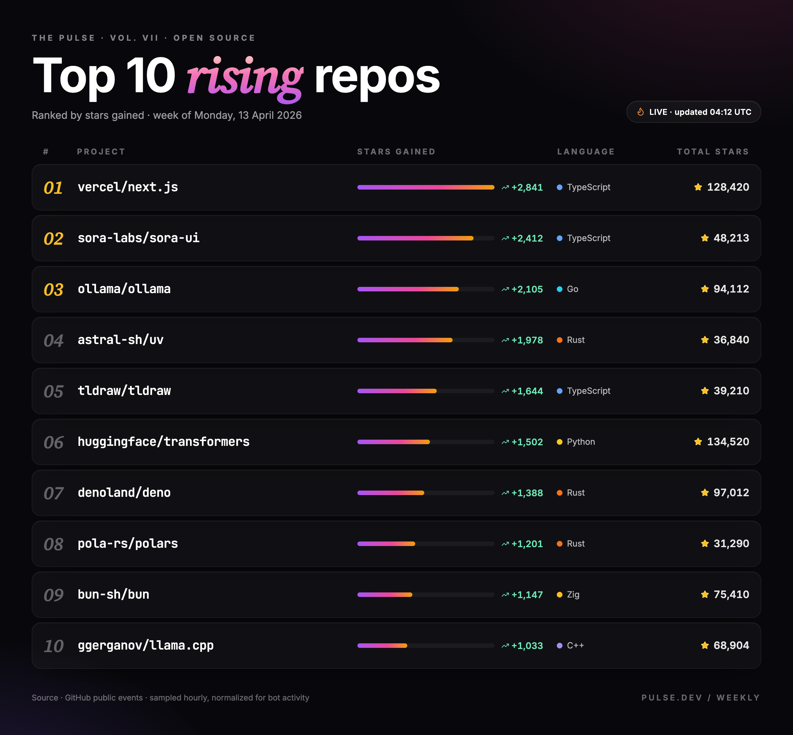</a></td>
    <td valign="top"><strong><code>leaderboard</code></strong> · <a href="examples/leaderboard.tsx">source</a> · <a href="examples/leaderboard.txt">prompt</a><br/><br/><sub>Make a leaderboard poster showing top 10 open-source projects ranked by stars this week. Include rank, name, stars, language, delta.</sub></td>
  </tr>
  <tr>
    <td width="45%" valign="top"><a href="examples/memphis.png">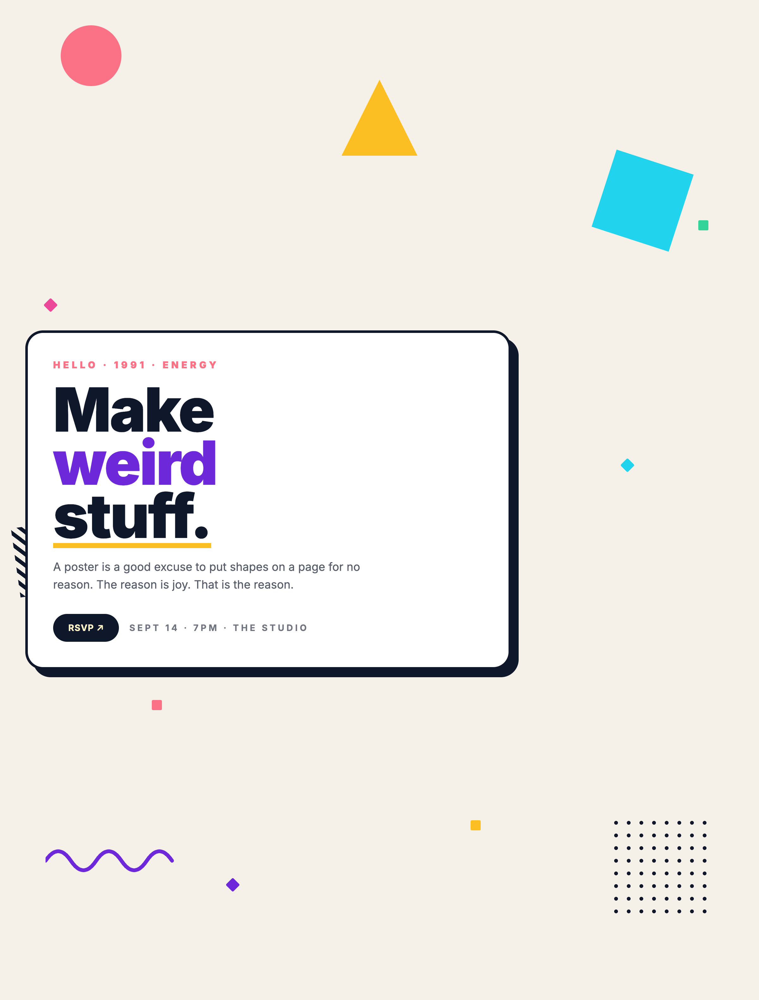</a></td>
    <td valign="top"><strong><code>memphis</code></strong> · <a href="examples/memphis.tsx">source</a> · <a href="examples/memphis.txt">prompt</a><br/><br/><sub>Make a Memphis-Group / 80s postmodern design poster - warm cream base (#f5f1e8), floating geometric shapes (pink circles, mint squares, terracotta triangles), squiggle SVG paths, playful primary palette, asymmetric composition, big sans-serif headline.</sub></td>
  </tr>
  <tr>
    <td width="45%" valign="top"><a href="examples/menu.png">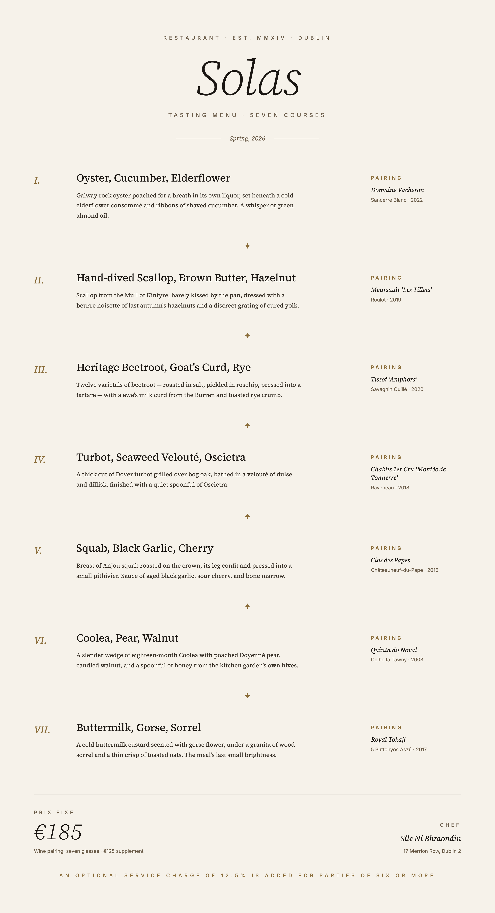</a></td>
    <td valign="top"><strong><code>menu</code></strong> · <a href="examples/menu.tsx">source</a> · <a href="examples/menu.txt">prompt</a><br/><br/><sub>Make a fine-dining 7-course tasting menu for restaurant 'Solas' - each course with name, prose description, optional wine pairing column on the right, prix fixe footer (€185), set in a quiet editorial layout with serif type.</sub></td>
  </tr>
  <tr>
    <td width="45%" valign="top"><a href="examples/moviepost.png">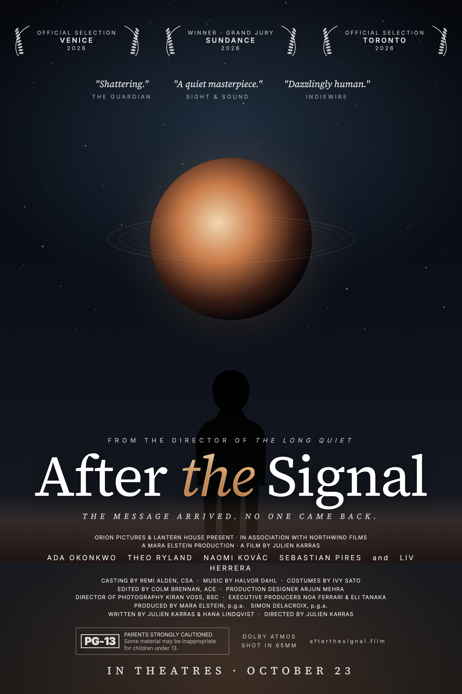</a></td>
    <td valign="top"><strong><code>moviepost</code></strong> · <a href="examples/moviepost.tsx">source</a> · <a href="examples/moviepost.txt">prompt</a><br/><br/><sub>Make a movie poster for a fictional film 'After the Signal' (sci-fi drama). Big serif title, tagline, faux-billing block at the bottom (cast, director, etc), MPAA-style rating box, festival laurels, release date - all that movie-poster apparatus.</sub></td>
  </tr>
  <tr>
    <td width="45%" valign="top"><a href="examples/natalchart.png">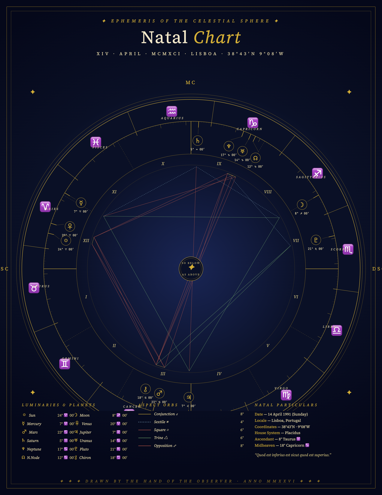</a></td>
    <td valign="top"><strong><code>natalchart</code></strong> · <a href="examples/natalchart.tsx">source</a> · <a href="examples/natalchart.txt">prompt</a><br/><br/><sub>Make an astrology natal chart poster - circular zodiac wheel divided into 12 houses, planet glyphs placed in signs, aspect lines crossing the center, dark navy with gold ink, esoteric serif type. Subject: born 14 Apr 1991, Lisbon.</sub></td>
  </tr>
  <tr>
    <td width="45%" valign="top"><a href="examples/neon.png">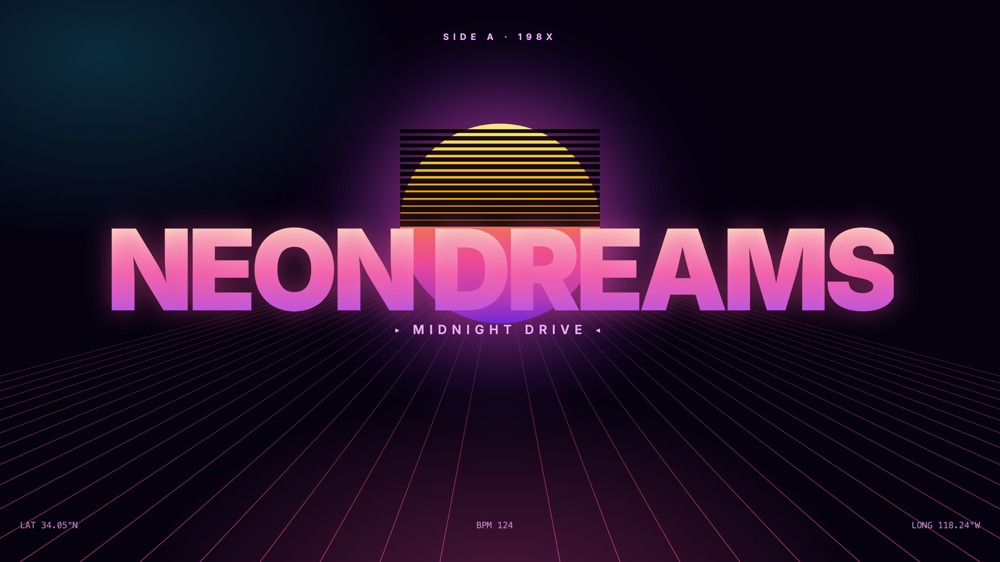</a></td>
    <td valign="top"><strong><code>neon</code></strong> · <a href="examples/neon.tsx">source</a> · <a href="examples/neon.txt">prompt</a><br/><br/><sub>Make a cyberpunk neon poster (1600px wide) - pure black background, glowing magenta/cyan scan lines (~14 horizontal stripes), grid floor perspective, retro-future synthwave type, single big number or word as the focal point.</sub></td>
  </tr>
  <tr>
    <td width="45%" valign="top"><a href="examples/newspaper.png">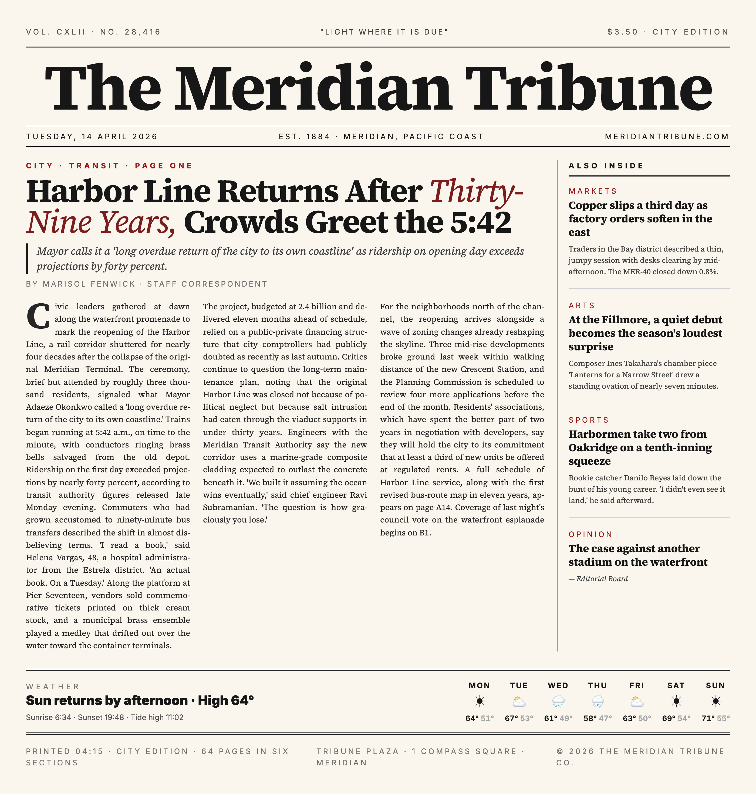</a></td>
    <td valign="top"><strong><code>newspaper</code></strong> · <a href="examples/newspaper.tsx">source</a> · <a href="examples/newspaper.txt">prompt</a><br/><br/><sub>Make a newspaper front page broadsheet from 'The Meridian Tribune' dated 14 April 2026. Masthead, lead story headline + 3 columns of dummy text, secondary stories in sidebar, weather strip, edition info.</sub></td>
  </tr>
  <tr>
    <td width="45%" valign="top"><a href="examples/patch.png">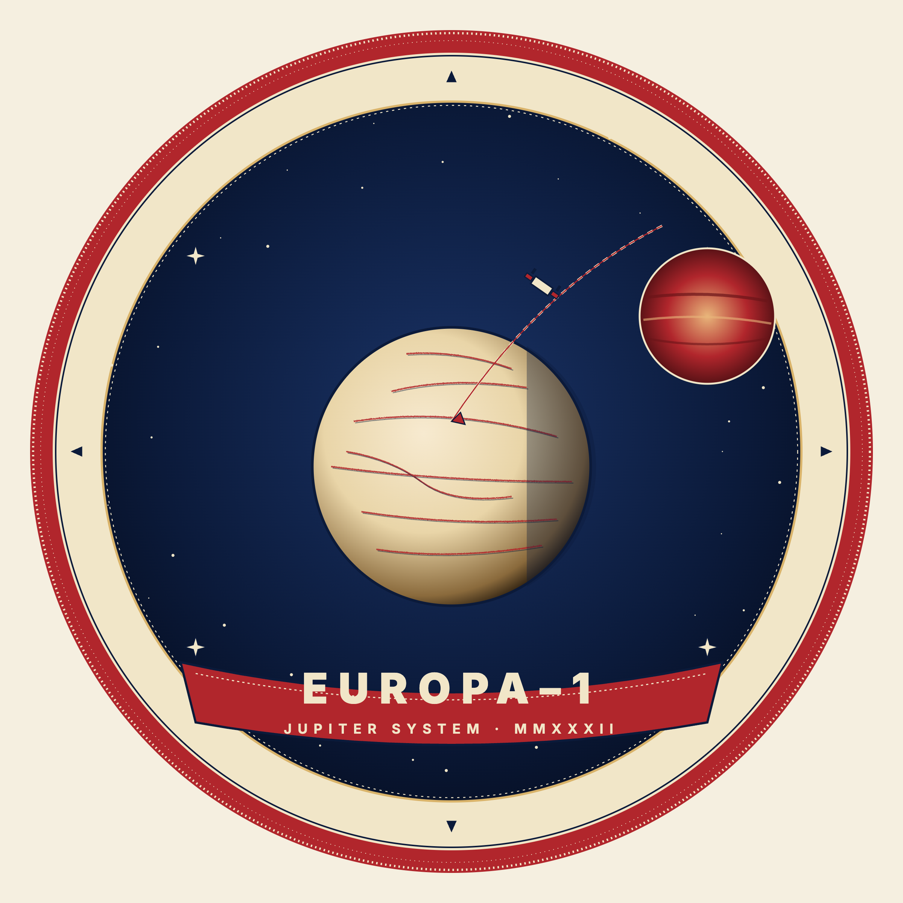</a></td>
    <td valign="top"><strong><code>patch</code></strong> · <a href="examples/patch.tsx">source</a> · <a href="examples/patch.txt">prompt</a><br/><br/><sub>Make a NASA-style circular mission patch design for 'EUROPA-1' - a fictional 2032 Jupiter moon mission. Crew of 4 names around the rim, central illustration of Europa with a probe trajectory, embroidered-look outlines, deep navy/cream/red.</sub></td>
  </tr>
  <tr>
    <td width="45%" valign="top"><a href="examples/pricing.png">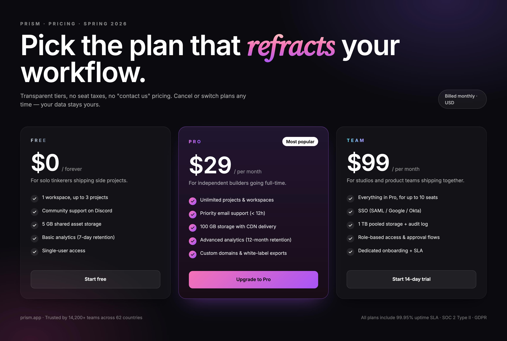</a></td>
    <td valign="top"><strong><code>pricing</code></strong> · <a href="examples/pricing.tsx">source</a> · <a href="examples/pricing.txt">prompt</a><br/><br/><sub>Make a pricing table poster for a SaaS called Prism with 3 tiers: Free ($0), Pro ($29/mo), Team ($99/mo). Include 5 feature rows per tier with checkmarks.</sub></td>
  </tr>
  <tr>
    <td width="45%" valign="top"><a href="examples/propaganda.png">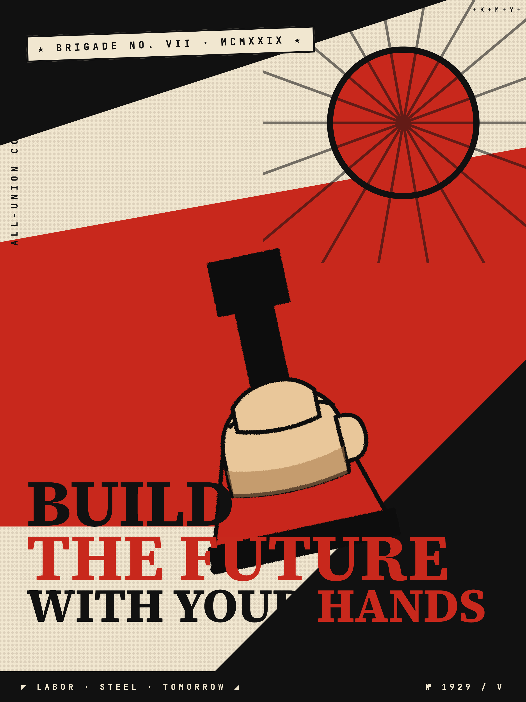</a></td>
    <td valign="top"><strong><code>propaganda</code></strong> · <a href="examples/propaganda.tsx">source</a> · <a href="examples/propaganda.txt">prompt</a><br/><br/><sub>Make a Soviet constructivist propaganda poster (in English) - bold red and black geometric shapes, diagonal composition, all-caps slab serif type, fist holding a wrench. Headline: 'BUILD THE FUTURE WITH YOUR HANDS'. Year 1929 aesthetic.</sub></td>
  </tr>
  <tr>
    <td width="45%" valign="top"><a href="examples/recipe.png">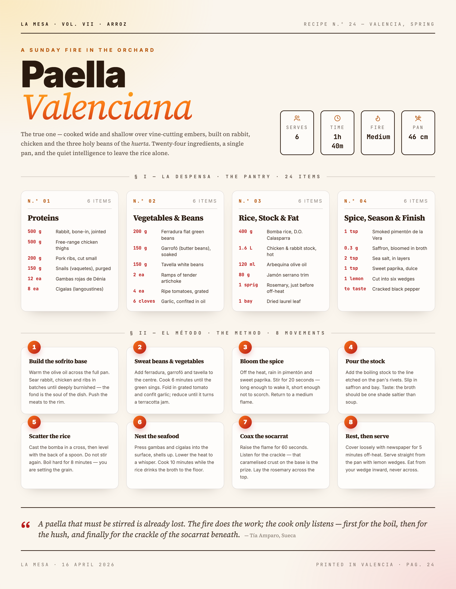</a></td>
    <td valign="top"><strong><code>recipe</code></strong> · <a href="examples/recipe.tsx">source</a> · <a href="examples/recipe.txt">prompt</a><br/><br/><sub>Make a beautifully typeset recipe poster for a complex paella valenciana with 24 ingredients across 4 categories, plus 8 numbered steps.</sub></td>
  </tr>
  <tr>
    <td width="45%" valign="top"><a href="examples/sankey.png">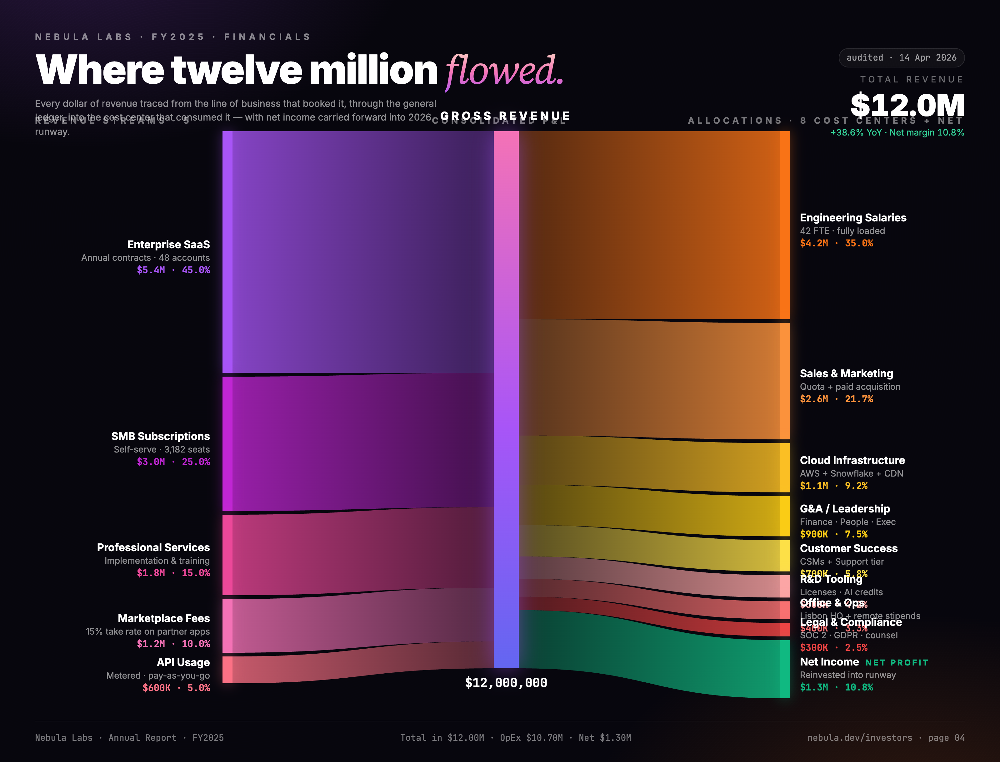</a></td>
    <td valign="top"><strong><code>sankey</code></strong> · <a href="examples/sankey.tsx">source</a> · <a href="examples/sankey.txt">prompt</a><br/><br/><sub>Make a Sankey diagram poster showing where a tech startup's annual revenue ($12M) flows: 5 revenue streams in → 8 cost categories out → net result. Real budget-like proportions, gradient ribbons, currency labels.</sub></td>
  </tr>
  <tr>
    <td width="45%" valign="top"><a href="examples/scorecard.png">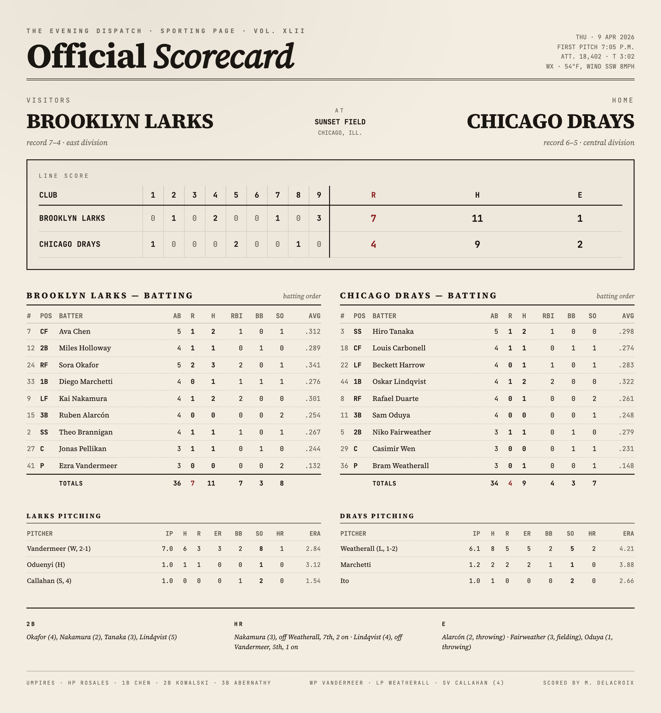</a></td>
    <td valign="top"><strong><code>scorecard</code></strong> · <a href="examples/scorecard.tsx">source</a> · <a href="examples/scorecard.txt">prompt</a><br/><br/><sub>Make a baseball scorecard for a fictional game: Brooklyn Larks vs. Chicago Drays · 9 Apr 2026 · Sunset Field. Inning-by-inning grid with R/H/E columns, batting lineup with positions (1B/2B/SS/etc), pitcher line stats. Newsprint sports-page aesthetic.</sub></td>
  </tr>
  <tr>
    <td width="45%" valign="top"><a href="examples/showcase.png">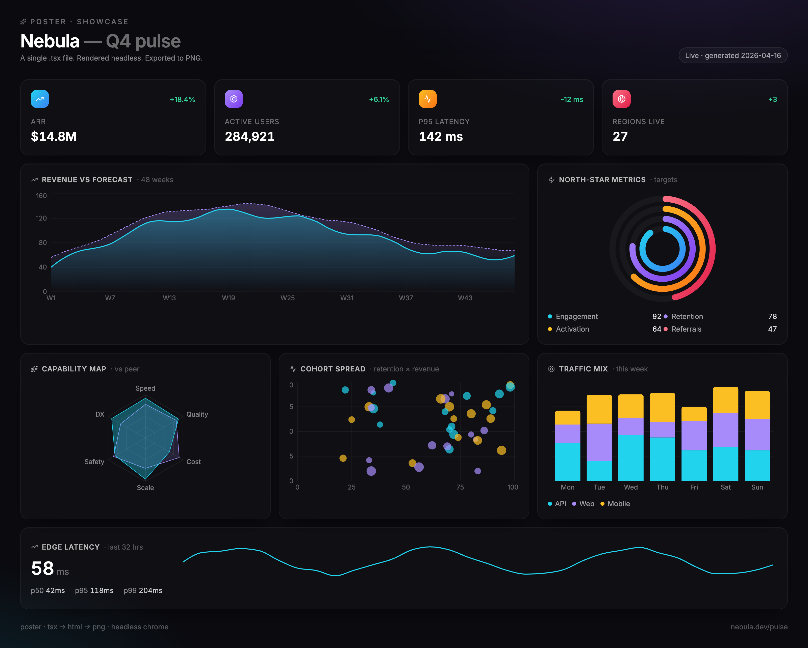</a></td>
    <td valign="top"><strong><code>showcase</code></strong> · <a href="examples/showcase.tsx">source</a> · <a href="examples/showcase.txt">prompt</a><br/><br/><sub>Make a multi-chart product analytics showcase poster (1600×1000) - five Recharts visualizations (Engagement / Retention / Activation / Referrals / Quality) on one canvas, KPI band at the top (active users, regions live), dark theme with rich gradient fills. Dense without feeling cramped.</sub></td>
  </tr>
  <tr>
    <td width="45%" valign="top"><a href="examples/stamp.png">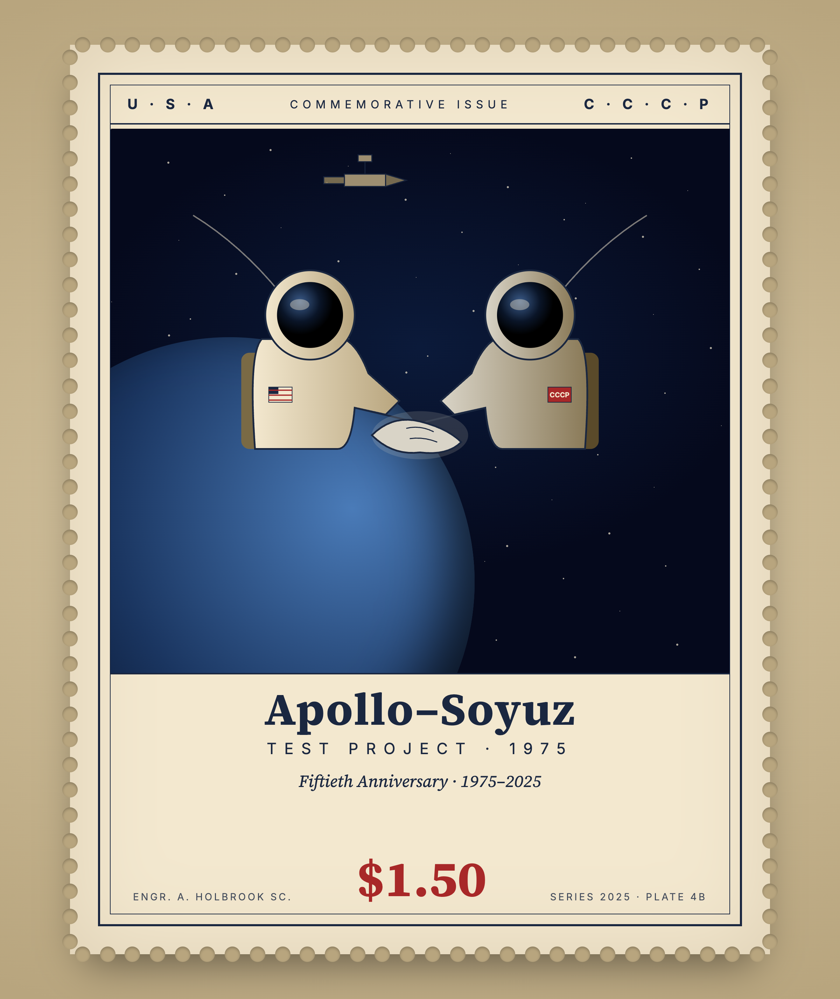</a></td>
    <td valign="top"><strong><code>stamp</code></strong> · <a href="examples/stamp.tsx">source</a> · <a href="examples/stamp.txt">prompt</a><br/><br/><sub>Make a vintage postage stamp design (single stamp, perforated edges) commemorating 'Apollo Soyuz 1975 - 50th Anniversary'. Two astronauts shaking hands in space, USA and CCCP labels, denomination '$1.50', tiny engraver's mark, perforation dots around the border.</sub></td>
  </tr>
  <tr>
    <td width="45%" valign="top"><a href="examples/subway.png">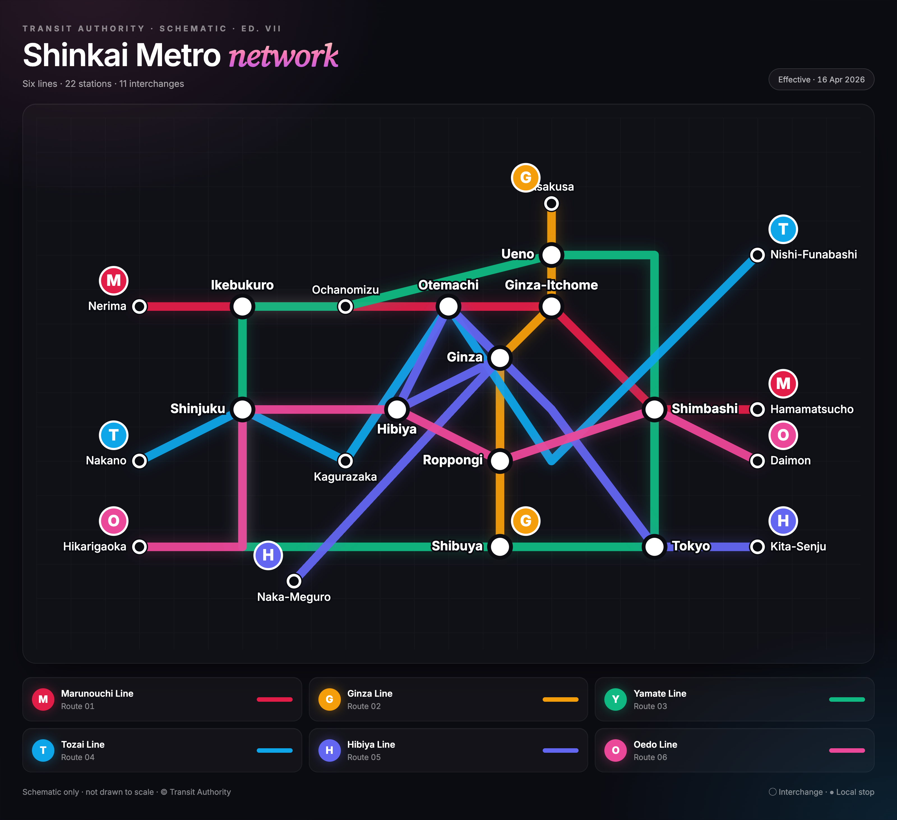</a></td>
    <td valign="top"><strong><code>subway</code></strong> · <a href="examples/subway.tsx">source</a> · <a href="examples/subway.txt">prompt</a><br/><br/><sub>Make a Tokyo subway-map style schematic showing 6 colored transit lines with named stations and interchange points - geometric, 45° / 90° angles only, line legend, route numbers in colored circles. A poster-style rendition, not a real map.</sub></td>
  </tr>
  <tr>
    <td width="45%" valign="top"><a href="examples/tarot.png">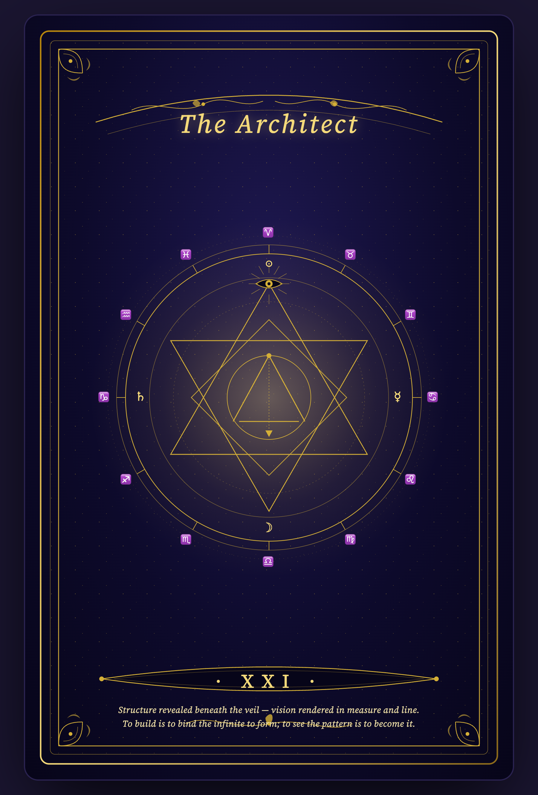</a></td>
    <td valign="top"><strong><code>tarot</code></strong> · <a href="examples/tarot.tsx">source</a> · <a href="examples/tarot.txt">prompt</a><br/><br/><sub>Make a tarot card 'The Architect' - Art Nouveau ornate borders, esoteric astrological symbols, gold-on-deep-indigo, central allegorical figure suggested geometrically. Include the card's roman numeral and meaning blurb at the bottom.</sub></td>
  </tr>
  <tr>
    <td width="45%" valign="top"><a href="examples/tradingcard.png">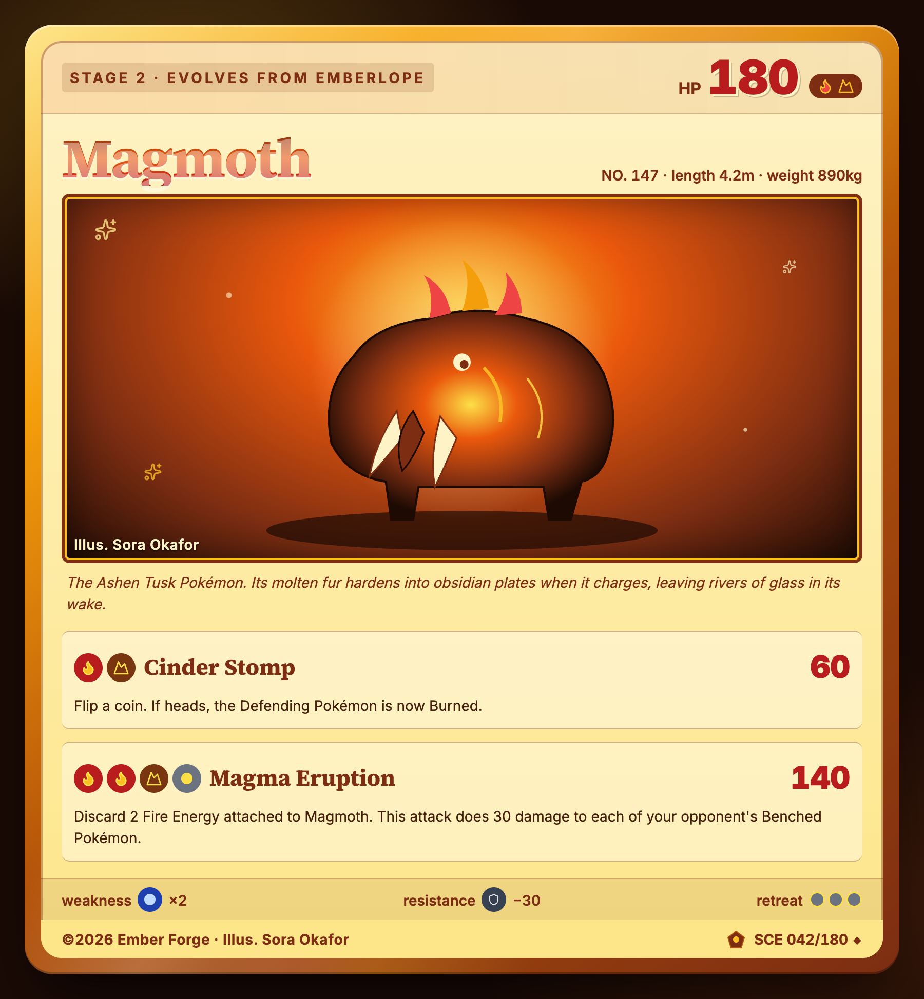</a></td>
    <td valign="top"><strong><code>tradingcard</code></strong> · <a href="examples/tradingcard.tsx">source</a> · <a href="examples/tradingcard.txt">prompt</a><br/><br/><sub>Make a Pokémon-style trading card for a fictional creature 'Magmoth' (Fire/Ground type) - HP, attacks with damage, evolution stage, foil-effect placeholder, illustrator credit, set symbol.</sub></td>
  </tr>
  <tr>
    <td width="45%" valign="top"><a href="examples/travelposter.png">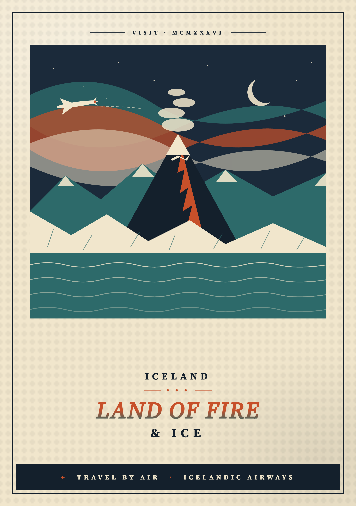</a></td>
    <td valign="top"><strong><code>travelposter</code></strong> · <a href="examples/travelposter.tsx">source</a> · <a href="examples/travelposter.txt">prompt</a><br/><br/><sub>Make a 1930s WPA-style travel poster for 'Iceland - Land of Fire and Ice' - flat geometric mountains and aurora, art deco type, limited 4-color palette, cream paper texture feel. Bottom strip: 'TRAVEL BY AIR · ICELANDIC AIRWAYS'.</sub></td>
  </tr>
  <tr>
    <td width="45%" valign="top"><a href="examples/vinyl.png">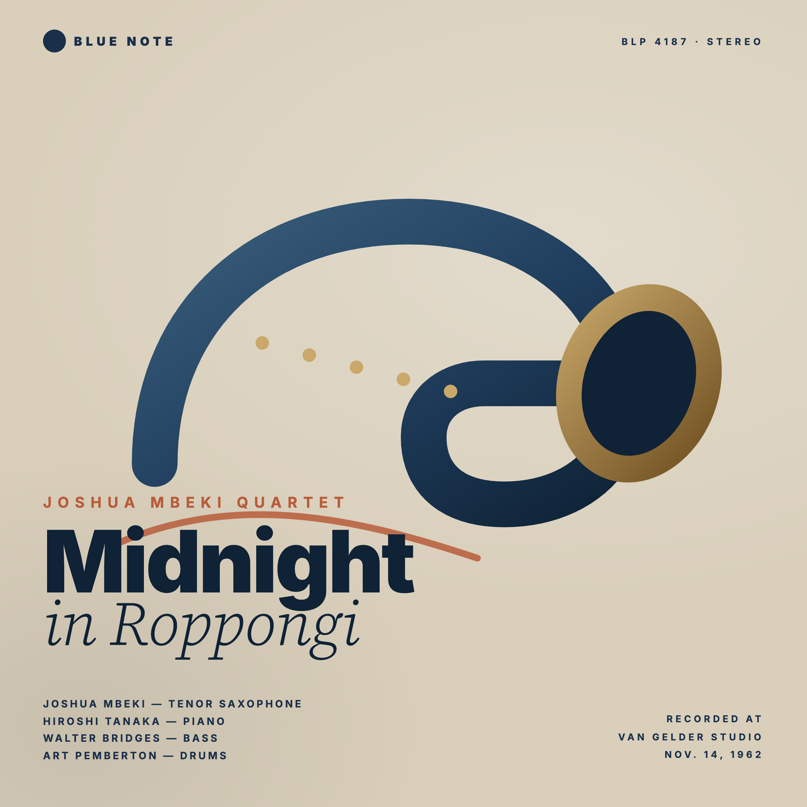</a></td>
    <td valign="top"><strong><code>vinyl</code></strong> · <a href="examples/vinyl.tsx">source</a> · <a href="examples/vinyl.txt">prompt</a><br/><br/><sub>Make a square Blue Note Records style jazz album cover for a fictional 1962 record 'Midnight in Roppongi' by tenor saxophonist Joshua Mbeki Quartet. Cool muted palette, bold sans serif credits, generous whitespace, one big abstract shape suggesting horns.</sub></td>
  </tr>
  <tr>
    <td width="45%" valign="top"><a href="examples/vogue.png">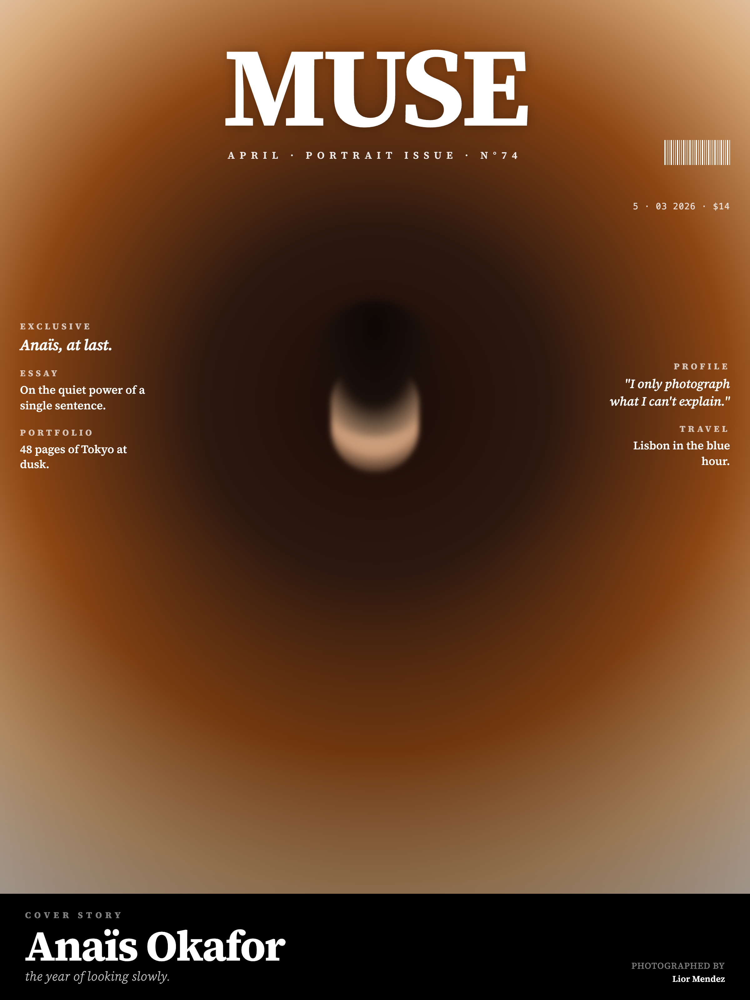</a></td>
    <td valign="top"><strong><code>vogue</code></strong> · <a href="examples/vogue.tsx">source</a> · <a href="examples/vogue.txt">prompt</a><br/><br/><sub>Make a Vogue-style magazine cover (1200px wide) - abstract radial gradient suggesting a portrait (deep umber centre fading to peach), serif masthead at top, single italic pull quote ('I only photograph what I can't explain.'), edition info, cover-line teasers down one side. Source Serif 4 throughout.</sub></td>
  </tr>
  <tr>
    <td width="45%" valign="top"><a href="examples/weather.png">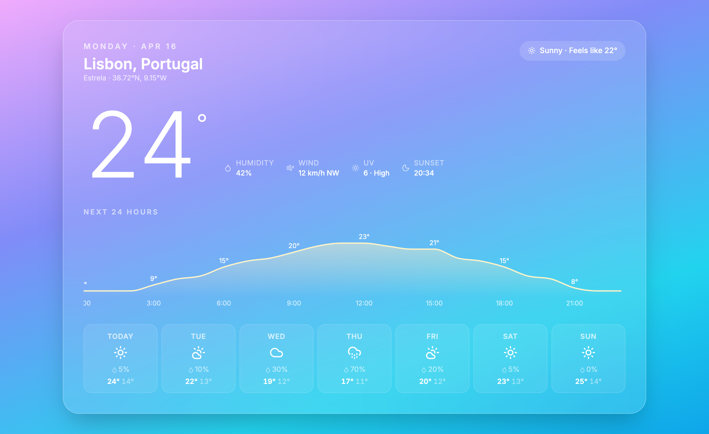</a></td>
    <td valign="top"><strong><code>weather</code></strong> · <a href="examples/weather.tsx">source</a> · <a href="examples/weather.txt">prompt</a><br/><br/><sub>Make a weather hero card (1400×900) - painted gradient sky background (peach to dusty blue), large frosted-glass card overlaid with current temperature, condition, hourly trend area chart, humidity and wind tiles. Soft, atmospheric, calming.</sub></td>
  </tr>
  <tr>
    <td width="45%" valign="top"><a href="examples/weather2.png">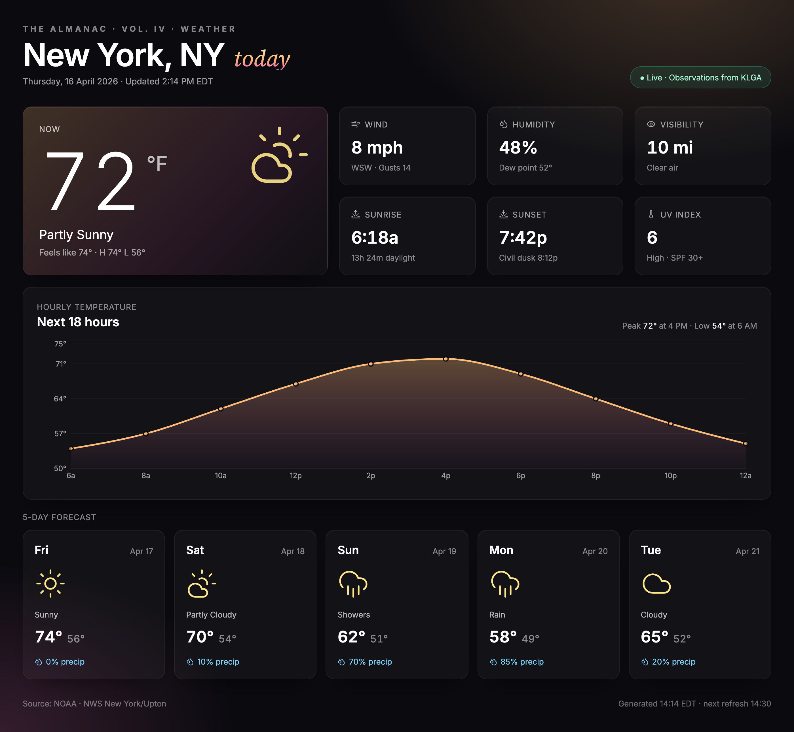</a></td>
    <td valign="top"><strong><code>weather2</code></strong> · <a href="examples/weather2.tsx">source</a> · <a href="examples/weather2.txt">prompt</a><br/><br/><sub>Make a weather forecast card for New York: today's conditions, 5-day forecast, hourly temperature line chart.</sub></td>
  </tr>
  <tr>
    <td width="45%" valign="top"><a href="examples/winelabel.png">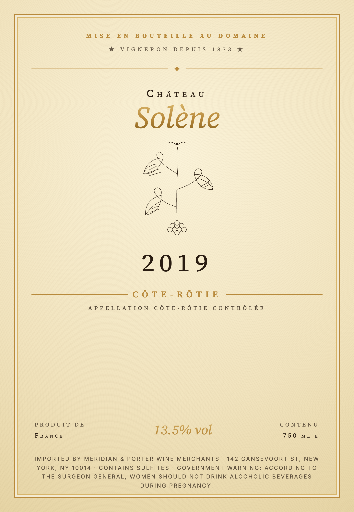</a></td>
    <td valign="top"><strong><code>winelabel</code></strong> · <a href="examples/winelabel.tsx">source</a> · <a href="examples/winelabel.txt">prompt</a><br/><br/><sub>Make a wine label for 'Château Solène 2019, Côte-Rôtie' - engraved botanical illustration, gold serif type, alcohol percentage, AOC line, importer footer in fine print. Vertical bottle label proportions.</sub></td>
  </tr>
  <tr>
    <td width="45%" valign="top"><a href="examples/wrapped.png">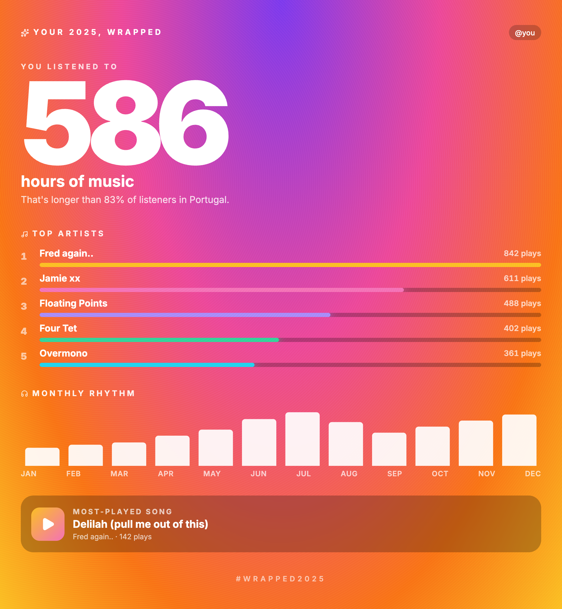</a></td>
    <td valign="top"><strong><code>wrapped</code></strong> · <a href="examples/wrapped.tsx">source</a> · <a href="examples/wrapped.txt">prompt</a><br/><br/><sub>Make a Spotify-Wrapped-style year-in-review poster in vertical story format (1080×1350) - top artists list (Fred again.., Jamie xx, Floating Points, Four Tet, Overmono), top genres bar chart, listening minutes hero stat, monthly listening rhythm. Vibrant gradient backdrop, bold display type.</sub></td>
  </tr>
  <tr>
    <td width="45%" valign="top"><a href="examples/zine.png">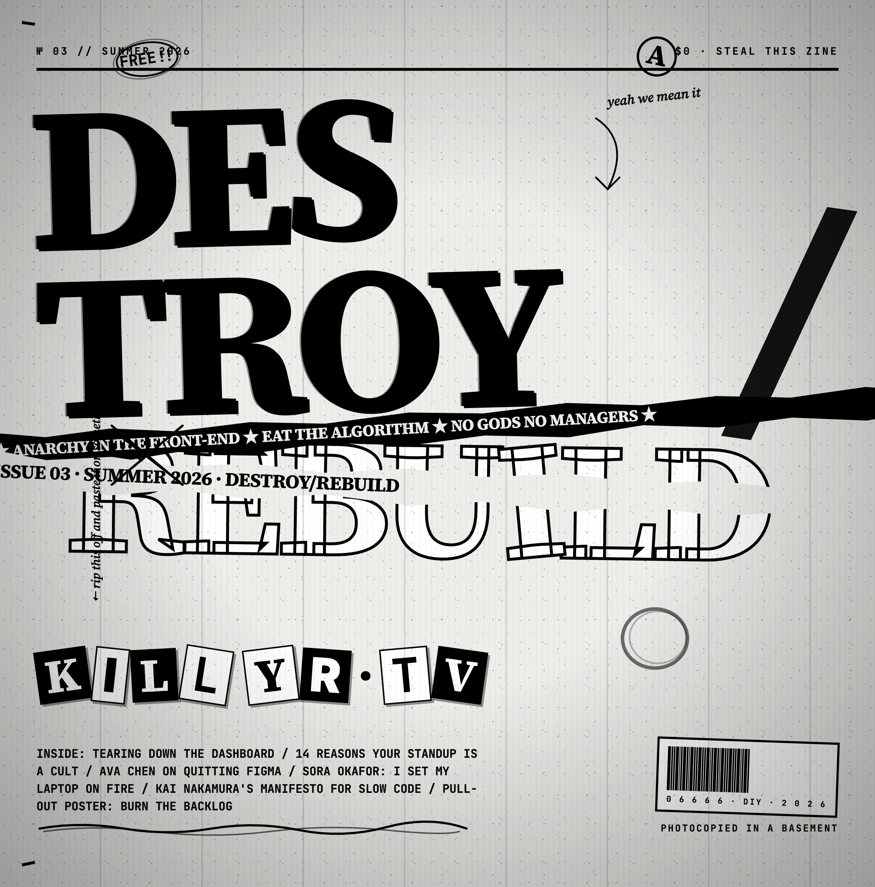</a></td>
    <td valign="top"><strong><code>zine</code></strong> · <a href="examples/zine.tsx">source</a> · <a href="examples/zine.txt">prompt</a><br/><br/><sub>Make a punk zine cover - high-contrast black and white photocopy aesthetic, hand-cut newsprint type, scribble annotations, 'ISSUE 03 · SUMMER 2026 · DESTROY/REBUILD'. Feels Xeroxed and angry.</sub></td>
  </tr>
</table>
<!-- gallery:end -->
---

## Authoring

A poster is a file that default-exports a React component. **The root element declares the canvas** via `w-[Npx]` - the renderer measures it and crops the screenshot to that exact box. Add `h-[Npx]` only if you need a fixed aspect (story format, OG image); otherwise let the height grow with content.

```tsx
import { AreaChart, Area, XAxis, YAxis } from "recharts";
import { SparklesIcon } from "lucide-react";

const data = Array.from({ length: 24 }, (_, i) => ({
  h: i,
  v: 50 + Math.sin(i * 0.5) * 20,
}));

export default function App() {
  return (
    <div className="w-[1200px] p-10 bg-black text-white">
      <SparklesIcon className="h-6 w-6" />
      <h1 className="mt-4 text-5xl font-black">Hello</h1>
      <div style={{ width: "100%", height: 300 }} className="mt-8">
        <AreaChart data={data} width={1100} height={300}>
          <XAxis dataKey="h" />
          <YAxis />
          <Area dataKey="v" stroke="#22d3ee" fill="#22d3ee40" />
        </AreaChart>
      </div>
    </div>
  );
}
```

**In the box:** React 19, Tailwind (via CDN), [Recharts](https://recharts.org),
[lucide-react](https://lucide.dev), Inter + Source Serif 4 + JetBrains Mono
(loaded via Google Fonts so exports are consistent across machines).

**Authoring surface depends on the engine.** With `--engine chrome`,
anything that renders in Chrome renders here — hooks, context, `useState`,
animations, SVG, CSS gradients, `backdrop-filter`, fonts, the lot. With the
default `takumi` engine, the CSS subset is large but not complete: most
posters work as-is; a few patterns (gradient text, multi-layer absolute
blurs, SVG `<text>` inside serialized images) need authoring tweaks.

---

## Engines

`poster export` runs through one of two engines. Pick with `--engine` or
the `engine` option on the SDK.

### `takumi` — default

A pure-Rust headless renderer (taffy + parley + skrifa + resvg) shipped
as a NAPI native module. Real Tailwind v4 expands every class server-side
before handoff; Google Fonts CSS is fetched once and cached at
`~/.cache/poster/fonts/`; bare `import` specifiers auto-resolve through
esm.sh and cache at `~/.cache/poster/modules/`. Output is 2x physical
pixels for retina parity.

- **No browser, no download, fast.**
- **PNG only.** PDF / SVG / JPG / WebP require `--engine chrome`.
- **Subset of CSS.** Most posters work; some patterns need authoring
  tweaks (gradient text needs `display: inline-block` +
  `WebkitTextFillColor: transparent`; `overflow-hidden` on auto-height
  cards can clip).

### `chrome` — opt-in

Puppeteer drives a real Chromium and screenshots the rendered DOM
(DSF 2 for retina). What you see in Chrome is what lands in the file,
pixel-for-pixel.

- **Every format.** PNG, JPG, WebP, PDF (vector text), SVG (snapDOM).
- **Full CSS.** Anything Chrome renders works.
- **Needs Chrome.** Uses system Chrome / Brave / Edge if present;
  otherwise downloads `chrome-headless-shell` (~80 MB) on demand.

Browser resolution (chrome engine only):

1. `--browser <path>` if given
2. System Chrome / Brave / Edge / Chromium
3. Cached `chrome-headless-shell` from `@puppeteer/browsers`
4. Auto-install (~80 MB) if `--install-browser` is passed

### Format support matrix

| Format | `takumi` | `chrome` | Notes |
|---|---|---|---|
| `png` | ✓ default | ✓ | Lossless, DSF 2. Transparent unless poster paints a background. |
| `jpg` | — | ✓ | Quality 100. White background from the shell's body. |
| `webp` | — | ✓ | Quality 100. Smallest raster at comparable fidelity. |
| `pdf` | — | ✓ | Vector text + SVG, raster images at 96 DPI. Text stays selectable. |
| `svg` | — | ✓ | Scalable, fonts embedded. Captured via snapDOM in-page. |

### Browser download

The postinstall **never** downloads Chrome by default — the default engine
is browserless. Opt in explicitly when you want the Chrome engine ready
out of the box:

```bash
POSTER_INSTALL_BROWSER=1 npm install -g poster-ai   # prefetch ~80 MB
POSTER_SKIP_BROWSER_DOWNLOAD=1 npm install poster-ai  # always skip
```

If the download fails (offline, proxy, etc.), install still succeeds.
Run `poster export --engine chrome --install-browser` later to retry,
or install Chrome / Brave / Edge through your OS and skip the bundled
binary entirely.

---

## For agents

- Every CLI command supports `--json` for machine-readable output.
- Entry `-` reads TSX from stdin, so a single call produces an image with
  no filesystem scaffolding: `echo '...' | poster export - -o out.png`.
- Saved `.poster/<name>.tsx` lets the agent iterate on its own output.
- The SDK (`import { Poster }`) is pure: discriminated input, data out,
  errors throw. No process control, no ambient logging.
- The renderer auto-fits the canvas to whatever the root `w-[Npx]` declares,
  so agents don't have to think about viewport sizes.

For [pi](https://github.com/badlogic/pi-mono) users,
[**pi-poster**](https://github.com/Michaelliv/pi-poster) registers a
`poster_render` tool plus a comprehensive `poster` skill so the agent
knows the layout grammar, color systems, font floor, and signature
patterns up front. Most of the gallery in `examples/` was generated
through that loop - every example has a paired `.txt` sidecar
(`vinyl.png` + `vinyl.tsx` + `vinyl.txt`) so you can see exactly what
input produced what output.

---

## Requirements

- Node 18+
- macOS, Linux, or Windows
- **For PNG (default engine):** nothing else — Takumi ships as a NAPI module.
- **For PDF / SVG / JPG / WebP (`--engine chrome`):** Chrome / Brave / Edge
  installed, **or** ~80 MB for the fallback `chrome-headless-shell`.

---

## License

MIT.
