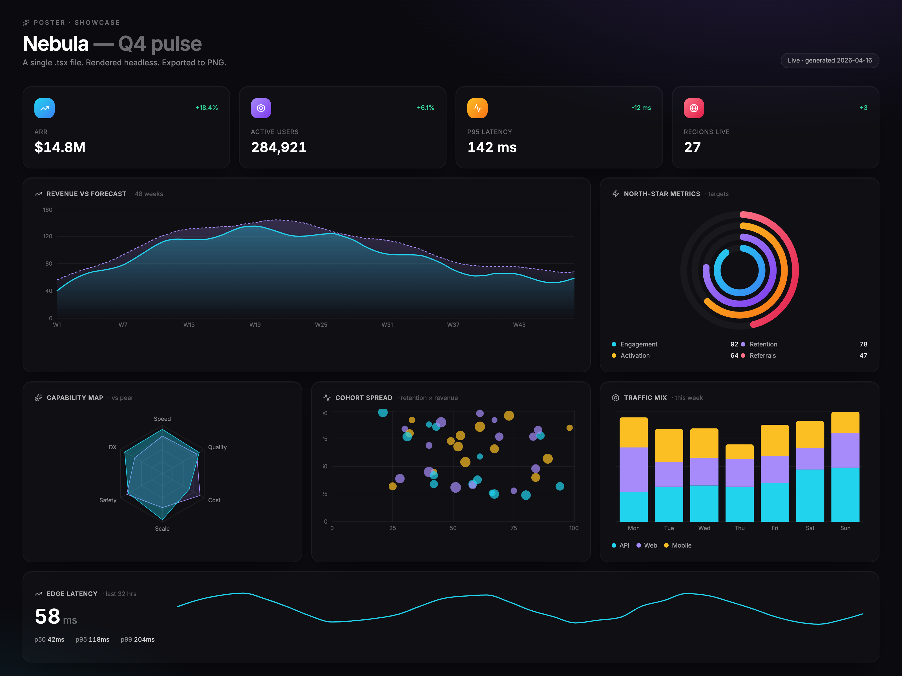
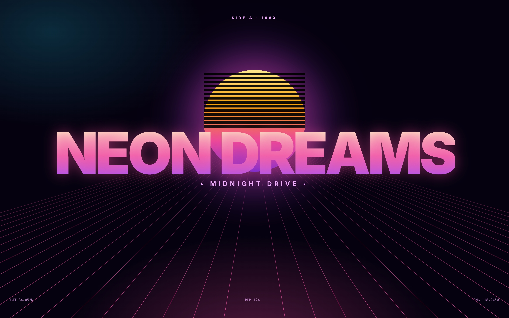
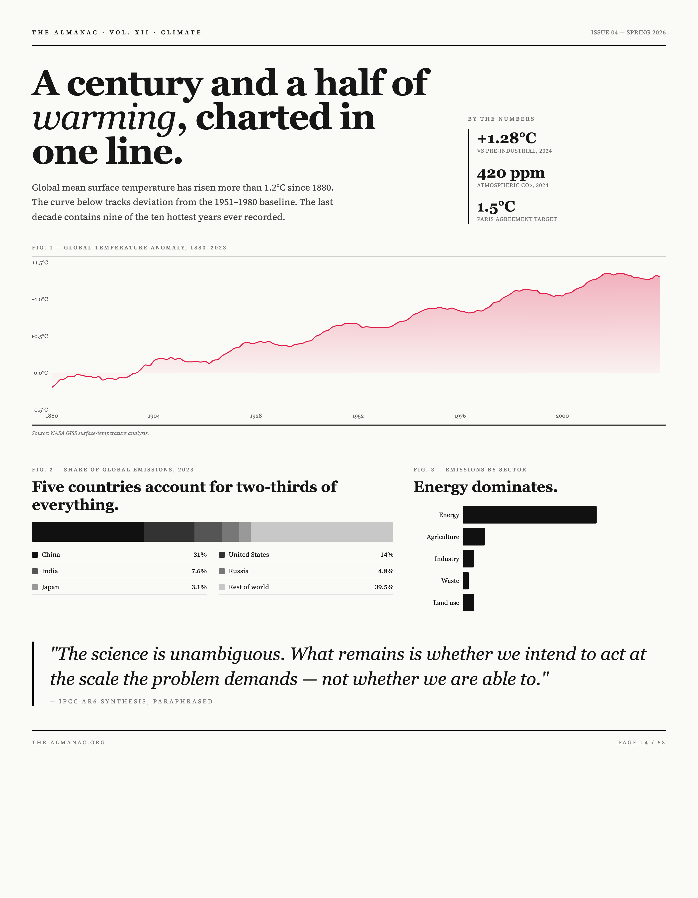
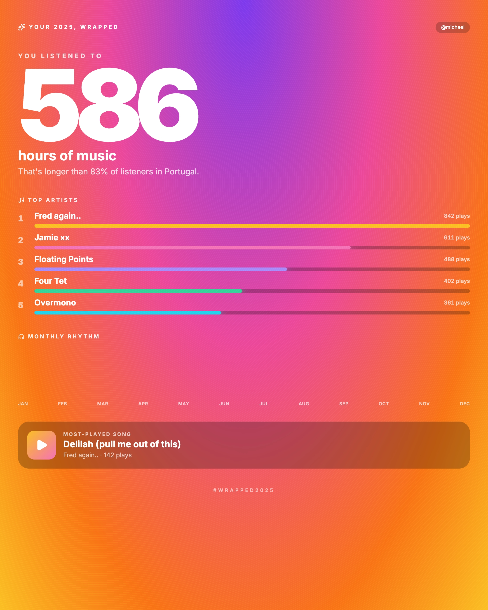

# poster

<p align="center">
  
</p>

> **One `.tsx` file, every format you'll ever need.**

Write a React component. Get a self-contained `.html` file, a PNG, a PDF, an
SVG, a JPG, or a WebP — at any canvas size. No browser fidelity loss, no
Satori-subset restrictions, no design-tool lock-in. Works as a **CLI** for
humans and as a **library** for agents and services.

```bash
npm install -g poster-ai        # CLI (installs the `poster` binary)
npm install poster-ai           # library
```

---

## CLI

```bash
poster build app.tsx -o app.html            # self-contained .html
poster build app.tsx -o app.html --og       # ...with og:image baked in
poster export app.tsx -o out.png            # PNG via headless Chrome
poster export app.tsx -o out.pdf            # also svg / jpg / webp
```

Every command supports `--width`, `--height`, `--json`, and `--quiet`.

### Inline authoring for agents

Pass `-` as the entry and pipe TSX on stdin:

```bash
cat <<'EOF' | poster export - -o hero.png --width 1200 --height 600
export default function() {
  return (
    <div className="min-h-screen flex items-center justify-center bg-black text-white">
      <h1 className="text-7xl font-black">Hello, poster.</h1>
    </div>
  );
}
EOF
```

Stdin is persisted to `.poster/hero.tsx` by default so you can iterate —
either re-pipe updated TSX, or edit the saved file and run
`poster export .poster/hero.tsx -o hero.png`. Pass `--ephemeral` for
one-shot CI renders that touch no disk.

---

## Library

```ts
import { writeFileSync } from "node:fs";
import { Poster } from "poster-ai";

const poster = new Poster();

// TSX → self-contained HTML string
const html = await poster.buildHtml(
  { tsx: `export default () => <h1 className="text-5xl p-10">Hi</h1>` },
  { title: "Hello", width: 1200, height: 600 },
);

// TSX → PNG Buffer (also jpg / webp / pdf → Buffer, svg → string)
const png = await poster.render(
  { tsx: source },
  { format: "png", width: 1600, height: 900 },
);
writeFileSync("poster.png", png);

// Or render a file on disk
const pdf = await poster.render(
  { file: "./app.tsx" },
  { format: "pdf", width: 1400, height: 1800 },
);
```

- **Discriminated input.** `{ tsx }` for in-memory source, `{ file }` for a
  path. No ambiguity.
- **Pure.** Returns data; the caller writes it. No stdout writes, no
  `process.exit`, errors throw.
- **Typed.** Full `.d.ts` shipped. `BuildOptions`, `RenderOptions`,
  `ExportFormat`, `DEFAULTS` all exported.

---

## What it looks like

All seven designs below are a single `.tsx` file each, rendered through the
same pipeline. They live under [`examples/`](./examples) — copy one, tweak,
re-export.

<table>
  <tr>
    <td width="50%"></td>
    <td width="50%"></td>
  </tr>
  <tr>
    <td><strong><a href="examples/showcase.tsx">showcase.tsx</a></strong> — seven Recharts visualizations in one poster, shared gradient defs, glowing cards.</td>
    <td><strong><a href="examples/neon.tsx">neon.tsx</a></strong> — perspective grid, gradient sun with scan lines, text-clip gradient headline.</td>
  </tr>
  <tr>
    <td width="50%"></td>
    <td width="50%"></td>
  </tr>
  <tr>
    <td><strong><a href="examples/editorial.tsx">editorial.tsx</a></strong> — Source Serif 4 masthead, temperature-anomaly area chart, sector breakdown.</td>
    <td><strong><a href="examples/wrapped.tsx">wrapped.tsx</a></strong> — saturated radial gradient, 220px tabular-num hero, top-artist bars.</td>
  </tr>
</table>

Not shown, also in `examples/`: dashboards (Prism analytics, GitHub year-in-review, fitness rings), a glassmorphic weather card, a 90s Memphis invite, a Berlin concert poster, a calendar page, a brutalist magazine spread. Each is ~150–350 lines. No shared helpers — copy the one you like and make it yours.

---

## Authoring

A poster is a file that default-exports a React component.

```tsx
import { AreaChart, Area, XAxis, YAxis } from "recharts";
import { SparklesIcon } from "lucide-react";

const data = Array.from({ length: 24 }, (_, i) => ({
  h: i,
  v: 50 + Math.sin(i * 0.5) * 20,
}));

export default function App() {
  return (
    <div className="min-h-screen p-10 bg-black text-white">
      <SparklesIcon className="h-5 w-5" />
      <h1 className="mt-4 text-5xl font-black">Hello</h1>
      <div className="h-[300px] mt-8">
        <AreaChart data={data} width={800} height={300}>
          <XAxis dataKey="h" />
          <YAxis />
          <Area dataKey="v" stroke="#22d3ee" fill="#22d3ee40" />
        </AreaChart>
      </div>
    </div>
  );
}
```

**In the box:** React 19, Tailwind (via CDN), [Recharts](https://recharts.org),
[lucide-react](https://lucide.dev), Inter + Source Serif 4 + JetBrains Mono
(loaded via Google Fonts so exports are consistent across machines).

**No authoring restrictions** — this isn't Satori. Anything that renders in
Chrome renders here: hooks, context, `useState`, animations, SVG, CSS
gradients, `backdrop-filter`, fonts, the lot.

---

## Export pipeline

Exports screenshot the rendered DOM through a headless browser
(`puppeteer-core`). No Satori-subset fidelity loss — what you see in Chrome
is what lands in the PNG, pixel-for-pixel, at DSF 2 for retina.

**Browser resolution:**

1. `--browser <path>` if given
2. System Chrome / Brave / Edge / Chromium
3. Cached `chrome-headless-shell` from `@puppeteer/browsers`
4. Auto-install (~80 MB) if `--install-browser` is passed

| Format | Quality | Notes |
|---|---|---|
| `png` | Lossless, DSF 2 | Transparent background unless poster paints one |
| `jpg` | Quality 100 | White background from the shell's body |
| `webp` | Quality 100 | Smallest raster format at comparable fidelity |
| `pdf` | Vector text + SVG, raster images at 96 DPI | Text stays selectable |
| `svg` | Scalable, fonts embedded | Captured via snapDOM in-page |

### Browser download

On **global** install (`npm install -g poster-ai`), a postinstall step
fetches `chrome-headless-shell` (~80 MB) to `~/.cache/poster-browsers/` so
`poster export` works out of the box. **Local** installs (library
consumers) skip the download by default — you have your own Chrome, or
you'll opt in explicitly:

```bash
POSTER_INSTALL_BROWSER=1 npm install poster-ai   # force download
POSTER_SKIP_BROWSER_DOWNLOAD=1 npm install -g poster-ai   # force skip
```

If the download fails (offline, proxy, etc.), install still succeeds. Run
`poster export --install-browser` later to retry.

---

## OG images

`poster build --og` bakes a 1200×630 JPEG into the HTML as an `og:image`
data URL. Social preview support for data URLs is uneven in practice:
**Discord renders them**; **WhatsApp, Twitter/X, Facebook** currently
ignore data URLs and fall back to title + description only. For a
universal preview, pair the HTML with a separately-hosted `.png` and point
`og:image` at a real URL.

---

## For agents

- Every CLI command supports `--json` for machine-readable output.
- Entry `-` reads TSX from stdin, so a single call produces an image with
  no filesystem scaffolding: `echo '...' | poster export - -o out.png`.
- Saved `.poster/<name>.tsx` lets the agent iterate on its own output.
- The SDK (`import { Poster }`) is pure: discriminated input, data out,
  errors throw. No process control, no ambient logging.

See also: `examples/` — twelve of them are hand-authored, seven of those
were generated via a single stdin call each. Exact workflow an agent will use.

---

## Requirements

- Node 18+
- macOS, Linux, or Windows
- Chrome / Brave / Edge installed, **or** ~80 MB for the fallback
  `chrome-headless-shell`

---

## License

MIT — see [LICENSE](./LICENSE).
